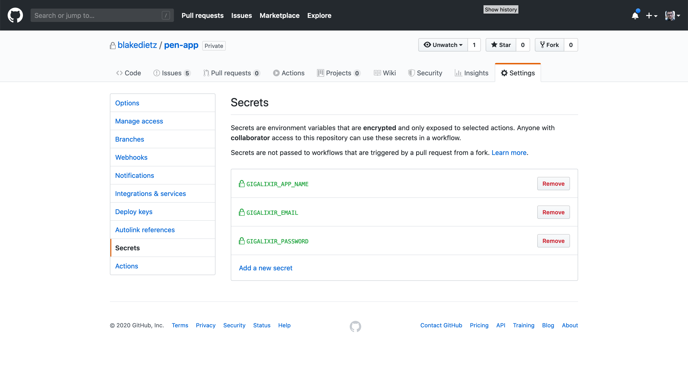
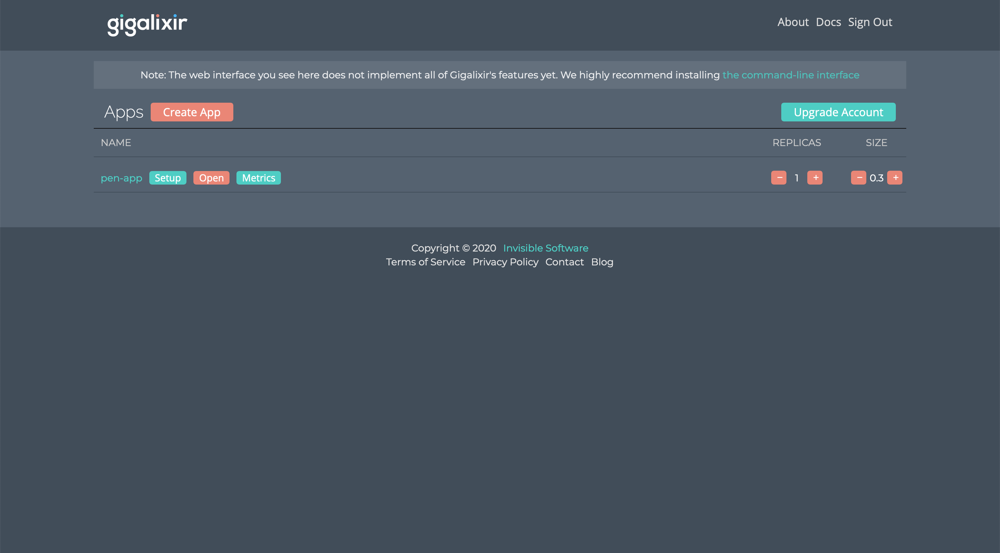

## Github actions

### Deploying to Gigalixir

#### Assumptions

This guide assumes that you're already running a Gigalixir application and have set up the necessary environment variables in Gigalixir. This guide also assumes that you've set up Distillery releases within your application. If you need help doing so, the [Gigalixir guide][gigalixir-guide] is actually quite good.

#### Setting up CD with Github Actions

I learned that Github actions are awesome and that deploying to Gigalixir is actually pretty straight forward. I found a few resources on how to run Github actions to deploy to Gigalixir, but I didn't see anything that shows you how to setup everything from start to finish. Here's how to run a release to Gigalixir from Github actions that includes code deploy along with database migrations.

First let's take a look at the `deploy.yml` file. I started off by creating a new file in my `.github/workflows` directory. If you don't have a workflow folder, go ahead and do some reading to learn more about `.github` and `.github/workflows` before continuing.

This file was recommended in the Gigalixir documents and is originally from [here][ga-gigalixir]. There's not much to it. We set up an `on` block that only gets triggered when a pull request is closed for the master branch. This is leveraged with a job level `if` block that checks to see if the request has been merged vs if it was only closed. You can see that here `if: github.event.pull_request.merged`.

From there in the `docker` job the container is set up with the Gigalixir cli. This leverages a few secrets that you'll need to set in the Github menu under the "Settings" tab.

Those secrets and their descriptions are here:

| Secret             | Description                                           |
| ------------------ | ----------------------------------------------------- |
| GIGALIXIR_EMAIL    | The email you use to log in to Gigalixir.             |
| GIGALIXIR_PASSWORD | The passowrd you use to log in to Gigalixir.          |
| GIGALIXIR_APP_NAME | The application name for which you want to deploy to. |

Here's an example of where that is in Github:



These are the same credentials that you'll be using for your Gigalixir account. You'll also need to set the application name of the app that you're deploying. You can find that in your Gigalixir dashboard.



```yaml
# ./.github/workflows/deploy.yml
---
name: Deploy
on:
  pull_request:
    types: [closed]
    branches:
      - master
jobs:
  docker:
    runs-on: ubuntu-latest
    if: github.event.pull_request.merged
    steps:
      - uses: actions/checkout@v1
      - run: sudo pip install gigalixir --ignore-installed six
      - run: gigalixir login -e "${{ secrets.GIGALIXIR_EMAIL }}" -y -p "${{ secrets.GIGALIXIR_PASSWORD }}"
      - run: gigalixir git:remote ${{ secrets.GIGALIXIR_APP_NAME }}
      - run: git push -f gigalixir HEAD:refs/heads/master
```

Now you're almost done. This will deploy new code out to Gigalixir whenever a pull request is _closed and merged_ into `master`. Now what about database migrations?

#### Setting up database migrations to run on release with Distillery

Distillery has a concept called "hooks". These hooks are run at various parts of the application lifecycle. There's a wonderful resource on hooks that you can read [here][boot-hooks].

We're going to utilize a "pre-start" hook to run the database migrations whenever the application is deployed. To do so, first we'll add a `ReleaseTasks` module under `./lib/app/release_tasks.ex` to the application. Here `MyApp` would be whatever your application name is.

This file was taken directly from [here][distillery-migrations]. As mentioned in the aforementioned reference, make sure to put this file under your `lib` folder to ensure it's compiled upon build.

```elixir
# ./lib/app/release_tasks

defmodule MyApp.ReleaseTasks do
  @start_apps [
    :crypto,
    :ssl,
    :postgrex,
    :ecto,
    :ecto_sql # If using Ecto 3.0 or higher
  ]

  @repos Application.get_env(:my_app, :ecto_repos, [])

  def migrate(_argv) do
    start_services()

    run_migrations()

    stop_services()
  end

  def seed(_argv) do
    start_services()

    run_migrations()

    run_seeds()

    stop_services()
  end

  defp start_services do
    IO.puts("Starting dependencies..")
    # Start apps necessary for executing migrations
    Enum.each(@start_apps, &Application.ensure_all_started/1)

    # Start the Repo(s) for app
    IO.puts("Starting repos..")

    # pool_size can be 1 for ecto < 3.0
    Enum.each(@repos, & &1.start_link(pool_size: 2))
  end

  defp stop_services do
    IO.puts("Success!")
    :init.stop()
  end

  defp run_migrations do
    Enum.each(@repos, &run_migrations_for/1)
  end

  defp run_migrations_for(repo) do
    app = Keyword.get(repo.config(), :otp_app)
    IO.puts("Running migrations for #{app}")
    migrations_path = priv_path_for(repo, "migrations")
    Ecto.Migrator.run(repo, migrations_path, :up, all: true)
  end

  defp run_seeds do
    Enum.each(@repos, &run_seeds_for/1)
  end

  defp run_seeds_for(repo) do
    # Run the seed script if it exists
    seed_script = priv_path_for(repo, "seeds.exs")

    if File.exists?(seed_script) do
      IO.puts("Running seed script..")
      Code.eval_file(seed_script)
    end
  end

  defp priv_path_for(repo, filename) do
    app = Keyword.get(repo.config(), :otp_app)

    repo_underscore =
      repo
      |> Module.split()
      |> List.last()
      |> Macro.underscore()

    priv_dir = "#{:code.priv_dir(app)}"

    Path.join([priv_dir, repo_underscore, filename])
  end
end
```

At this point we'll also need to create a new directory that houses our `pre-start` release hooks. I added the script under the following directory: `rel/commands/hooks/pre_start/migrate.sh`. Distillery will run all commands within the given directory. Also, you don't need to make the directory as nested, I just like using the folder structure for namespacing as it helps if there are going to be multiple lifecycle hooks.

Here's what `migrate.sh` looks like.

```bash
#!/bin/sh

echo "Running migrations"
release_ctl eval --mfa "App.ReleaseTasks.migrate/1" --argv -- "$@"
```

Next we'll update one more piece to tie everything together; `./rel/config.exs`. This is an autogenerated file that you should already have in your directory since we're assuming you've set up Distillery before following along. In this file, we'll tie the pre-start hook to the `migrate.sh` script, by passing the `pre_start_hooks` parameter the `./rel/commands/hooks/pre_start` directory. From there we'll also add a `migrate` command to make debugging and development nice.

```elixir
#... other code here just redacted

environment :prod do
  #... other code here just redacted
  # We're adding the line below
  set(pre_start_hooks: "rel/commands/hooks/pre_start")
end

#... other code here just redacted

release :app do
  #... other code here just redacted
  set(
    commands: [
      migrate: "rel/commands/hooks/pre_start/migrate.sh"
    ]
  )
end
```

We've updated the pre-start hooks and added a Distillery command named `migrate`. Updating the pre-start hooks lets Distillery know that we want to run all scripts (we only have one in this guide`migrate.sh`). This is going to run migrations ahead of starting the application. Adding the `migrate` command will allow us to run migrations against our elixir application live if we want to. This can be helpful in certain development scenarios. To do so you would run `bin/myapp migrate`.

And that's it. If you've followed along, now pushes to the master branch will trigger deployments along with database migrations.

Happy hacking!

## Sources

[ga-gigalixir]: https://gist.github.com/jesseshieh/7b231370874445592a40bf5ed6961460
[distillery-migrations]: https://github.com/bitwalker/distillery/blob/master/docs/guides/running_migrations.md
[boot-hooks]: https://github.com/bitwalker/distillery/blob/master/docs/extensibility/boot_hooks.md
[gigalixir-guide]: https://gigalixir.readthedocs.io/en/latest/main.html#distillery

1. [Gigalixir deploy with github actions][ga-gigalixir]
1. [Running migrations with distillery][distillery-migrations]
1. [Distillery boot hooks][boot-hooks]
1. [Installing distillery][gigalixir-guide]
