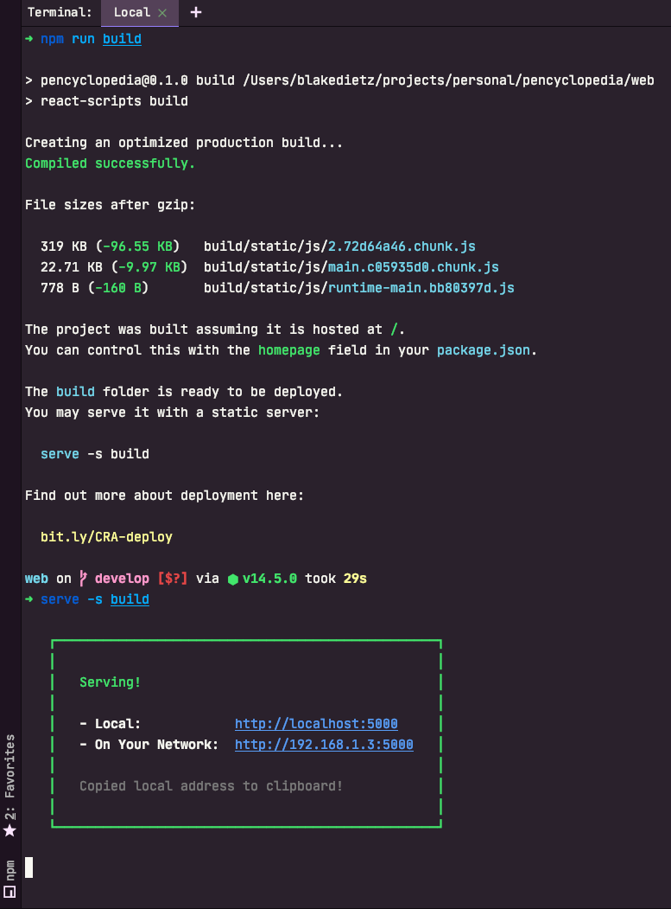
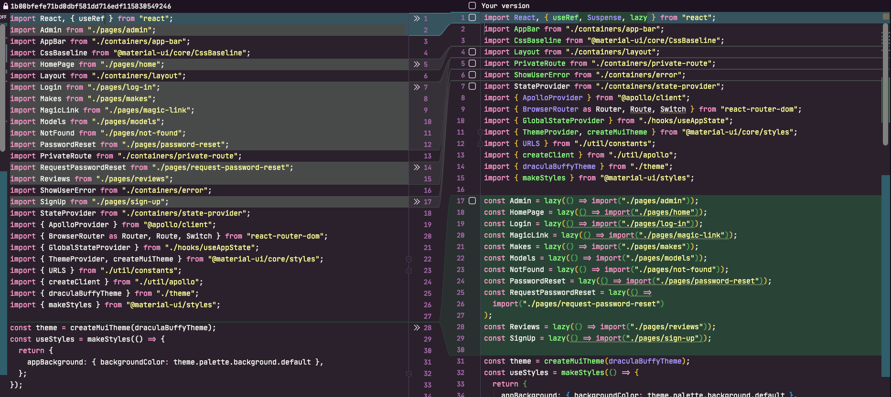

## One size does not fit all

Application requirements vary tremendously from one application to another. This guide is not meant to be a prescriptive
set of steps that anyone can apply to any single page application. This is a high level guide that gives you a few
helpful tips and some starting points to guide you along your own journey to a more performant frontend web application.

For this guide we'll be analyzing performance for https://pencyclopedia.ink. This is a personal SaaS project that I've
launched, so it's a little more real world than your usual tutorial. You'll learn about using [Lighthouse][lighthouse]
to analyze application performance along with a couple of practices for improving React application performance.

### Make your production build

First we'll need to make sure that the application binary is as close to the production build as possible. We don't want
development scripts to impact performance analysis. To do so, we'll use the `build`
command that was seeded by [CRA][cra] for this project. This creates a production ready asset that you can then
distribute.

```bash
# from the project root
# note: this assumes that application dependencies have already been installed via npm already
npm run build
# Install a static file server locally
npm i -g serve
# Serve your production assets locally
serve -s build
```



Above, we first run the build command to create the assets. We then install [serve](https://www.npmjs.com/package/serve)
which is a local static file server. From there the static file server is run locally to serve the built assets. This is
what Lighthouse is going to be running the analysis against. Of course, you could always run this against your
production site, but that makes iterating more cumbersome.

### Use Lighthouse to find bottlenecks

First of all, you need to identify if your application has any performance issues. Chrome has a built in tool called
Lighthouse that you can leverage to identify specific performance bottlenecks. To use Lighthouse, open Google Chrome
and do the following:

1. Navigate to the local file server's address
1. Open Chrome dev tools
1. Look for the Lighthouse tab


Lighthouse is ridiculously powerful. Learn more about what it does and how to use it [here](lighthouse). The simplest
way to get started is to click "Generate report". Once the report is generated, you'll see a high level
breakdown of your app performance at the top of the window.


Lighthouse is so powerful that it even picks up on project frameworks and gives you smart recommendations. Here's a
section from the report detailing unused code as a performance bottleneck for the home page and how you can address
the problem in React.


For this example, we just so happen to be running Lighthouse against a single page. While although Lighthouse is
reporting that there is dead code for the current page, it may very well be that the code is used somewhere else later
at a different point in the application, just not now, for the page we're analyzing. So the code may not be completely
dead in the sense that it's never used, just dead in the current user context.

This is where code splitting comes in. Traditionally web application bundles are sent as a singular binary. For a
user experience this can lead to users downloading all the code related to each page in the app, when they're only
viewing one page of the app.

Code splitting allows your application bundle to be split into multiple independent bundles called chunks. You can
think of chunks as asynchronous modules that are only requested by the client when they are required. So, how does
this help solve the unused code error that Lighthouse is reporting?

Code splitting allows you to divide your app into logical divisions. These logical divisions represent chunks which
are those bundles that are asynchronously loaded into the app when they're required. You can
code split at any logical division in your app. The most common logical division is done at page level
which just so happens to fit the current problem at hand as the code that's being reported as dead
is used, just not on the current page. So we can code split each page in the app. This would allow users to view
one page in the app, without pulling down the whole web application and in turn would help to fix the dead code
issue that we're currently facing for all pages in the app.

You don't have to stop at pages. For example if you had a tabs view that was relatively complex, you could code split
the page as well as each tab in that page effectively only loading the associated source code for the tab when the
user is attempting to interact with it.

React docs recommend starting at the [route level](route-level) (which is
practically page level) to leverage code splitting. This turned out to work well with my project because I'm utilizing
`react-router-dom` for the routing mechanism anyway. The documentation recommends leveraging `Suspense` along with
`lazy` and dynamic `import` to implement code splitting.

### Applying code splitting

Here's what the code looks like before and after:



Anything that was a top-level route component was converted from the ESModule language `import` syntax to use the
`lazy` and dynamic `import` functions that are provided by the `react` module instead.

You'll also need to wrap all of your router routes in the `Suspense` component as well. Below is an example of wrapping
all router components in a `Suspense` component.


Running `npm run build` now shows a different output from before.


Previously there were 3 different chunks. As you can see there's quite a few more after this change, and this is exactly
what we want. Leveraging code splitting, the application is able to separate parts of our application into separate
assets. These assets are only loaded when the application requires them at runtime. This allows for reducing overall
asset sizes which helps to improve load times for network constrained clients.

### Post splitting report

So, what's our new score?


Leveraging code splitting, our score jumped 46 points to a total of 89, which is pretty impressive considering the
amount of effort that was required to do so. This change puts the application on the edge of a good rating.

And for now, we'll leave it at that. It should be noted, that although the changes made in this walkthrough do impact
site wide load times, you'll need to run Lighthouse for each page in your application and assess the root cause of
performance issues accordingly.

## References

[lighthouse]: https://developers.google.com/web/tools/lighthouse
[gh-191]: https://github.com/facebook/react-devtools/issues/191
[react-suspense]: https://web.dev/code-splitting-suspense/?utm_source=lighthouse&utm_medium=devtools
[route-level]: https://reactjs.org/docs/code-splitting.html#route-based-code-splitting
[cra]: https://reactjs.org/docs/create-a-new-react-app.html

1. [Lighthouse](lighthouse)
1. [Removing dev tools issue](gh-191)
1. [React.lazy()](react-suspense)
1. [Route based code splitting](route-level)
1. [Create react app][cra]
