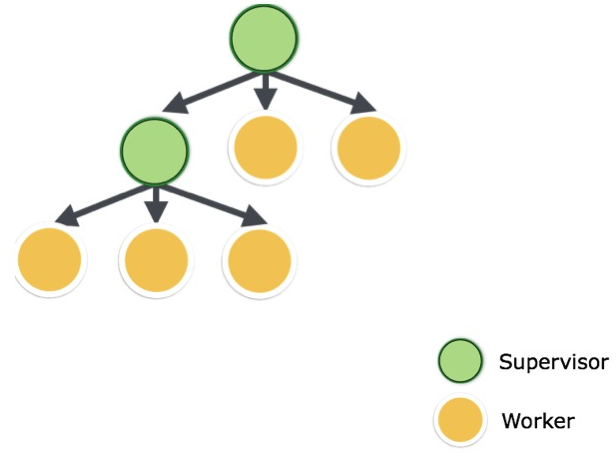

While at work I was reading through the [exq](https://github.com/akira/exq) library I stumbled upon [an issue](https://github.com/akira/exq/issues/129) that discussed the perils of running a Supervisor under a GenServer. Specifically Ben Wilson calls out the following:

> * "There is less guarantee provided by the supervision tree as the process might exit and the supervisor will not have terminated its children."
> * "This can lead to problems if the supervisors children are named because the named children might still exist when a restart occurs higher up the tree (above the process calling start_link in its init/1"
> * "you lose some advanced OTP features, like code reloading, as process modules are discovered by walking the supervision tree"

To my surprise the codebase I was working in, was using this pattern. Thankfully I was able to hunt down some resources that help to show how you should be modelling your process tree. The gist of it is this:

* Your process tree is composed of either worker nodes or supervisor nodes
* Nodes with children must be supervisors
* Leaf nodes must be workers (in our case GenServers)

Here's a nice graphic that was taken from [little-otp](https://freecontent.manning.com/little-elixir-and-otp-implementing-a-supervisor/) that helps to visualize everything from above.

## References

1. [Parent library](https://github.com/sasa1977/parent)
2. [Little Elixir and OTP: Implementing a Supervisor](https://freecontent.manning.com/little-elixir-and-otp-implementing-a-supervisor/)
3. [exq library](https://github.com/akira/exq)
4. [exq github issue](https://github.com/akira/exq/issues/129)
