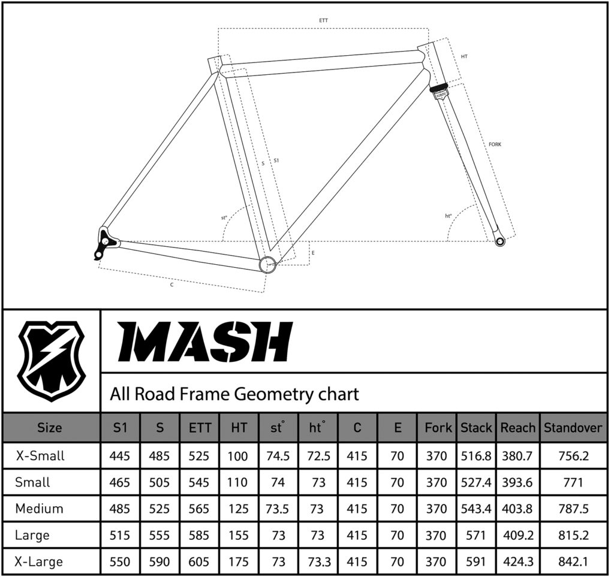

## Photos

Allyanna Wintermote took these photos while we were riding on the Hiawatha Trail in northern Idaho.

## Parts

<dl>
  <dt>Frame</dt>
  <dd>
    <dl>
    MASH steel all-road
      <dt>Frame</dt><dd>MASH Butted steel</dd>
      <dt>Fork rake</dt><dd>43 mm</dd>
      <dt>Seatpost size</dt><dd>27.2 mm</dd>
      <dt>Seat collar size</dt><dd>30.0 mm</dd>
      <dt>Headset spec</dt><dd>Traditional 1 1/8" headset</dd>
      <dt>Rear hub spacing</dt><dd>142 mm x 12 mm</dd>
      <dt>Front hub spacing</dt><dd>100 mm x 12 mm</dd>
      <dt>Disc mount style</dt><dd>Flat mount</dd>
      <dt>Cable routing</dt><dd>External</dd>
      <dt>Wheel size</dt><dd>700 c or 650 b</dd>
      <dt>Front derailleur</dt><dd>28.6 mm clamp on</dd>
      <dt>Max tire size</dt><dd>700 c x 38 mm or 650 b x 42 mm</dd>
    </dl>
  </dd>

  <dt>Crankset</dt>
  <dd>SRAM Rival 1 x 12</dd>

  <dt>Bars</dt>
  <dd>Zipp service course
    <dl>
      <dt>Width</dt>
      <dd>41 mm</dd>
    </dl>
  </dd>

  <dt>Wrap</dt>
  <dd>Lizard Skins Unisex's DSP Bar V2 Handlebar Grip Tape, Jet Black, One Size, DSPCY</dd>

  <dt>Stem</dt>
  <dd>
    Thomson X4
    <dl>
      <dt>Length</dt>
      <dd>70 mm</dd>
    </dl>
  </dd>

  <dt>Wheelset</dt>
  <dd>SRAM 303S (700c)</dd>

  <dt>Hub</dt>
  <dd>SRAM XDR</dd>

  <dt>Casette</dt>
  <dd>SRAM XG-1275 GX Eagle 12-Speed Cassette Black, B1, 10-52t</dd>

  <dt>Derailleur</dt>
  <dd>SRAM X01 Eagle 12-Speed Rear Derailleur Lunar, 52T</dd>

  <dt>Tires</dt>
  <dd>
    Pirelli Cinturato
    <dl>
      <dt>Width</dt>
      <dd>35c</dd>
    </dl>
  </dd>

  <dt>Front Caliper</dt>
  <dd>SRAM Force Hydraulic Disk Brake - Flat Mount Front, 1X, 950mm, No Rotor </dd>

  <dt>Rear Caliper</dt>
  <dd>SRAM Force Hydraulic Disk Brake - Flat Mount Rear, 11 Speed, 1800mm, No Rotor</dd>

  <dt>Front Disc Rotor</dt>
  <dd>SRAM Centerline XR Rotor 160mm, Centerlock</dd>

  <dt>Rear Disc Rotor</dt>
  <dd>SRAM Centerline XR Rotor 140mm, Centerlock</dd>

  <dt>Chain</dt>
  <dd>SRAM Chain Pcxx1 Eagle black 126L power lock</dd>

  <dt>Chainring</dt>
  <dd>Wolf Tooth Components: Direct Mount Chainrings for SRAM 8-Bolt × 1 (40T / Standard (45mm chainline) / Drop-Stop B)</dd>

  <dt>Headset</dt>
  <dd>Chris King NoThreadSet headset
    <dl>
      <dt>Color</dt>
      <dd>black sotto voce</dd>
    </dl>
  </dd>

  <dt>Seat post</dt>
  <dd>Whisky No.7 Carbon</dd>

  <dt>Saddle</dt>
  <dd>RICYRLK Bike Seat - Road Bike Saddle Comfortable MTB Saddle Lightweight Carbon Fiber Bicycle Saddle Cycling Leather Soft Seat Cushion</dd>

  <dt>Bottom bracket</dt>
  <dd>SRAM Dub BSA Bottom Bracket Road Wide, 68mm</dd>

  <dt>Mullet interface</dt>
  <dd>[Ratio 1 x 12 wide rear facing kit](https://ratiotechnology.com/product/1x12-wide-rear-cable/)</dd>
</dl>

## Specifications

### Frame

#### Geometry

## Learnings

### Facing

If you're purchasing a frame by itself, make sure to have a shop face the bike for you. You'll need to get disc brakes, bottom bracket and head tube faced to ensure good component fit.

### Bedding in brakes.

Don't forget to bed your brakes in before going on any serious rides.

### Protecting carbon levers

Your bike will fall over. Use helicopter tape on your carbon levers to keep them shiny.

### XD is compatible with XDR

As the title says. I found out that XD hubs are compatible with XDR casettes. You just have to add a small adapter that typically comes with the hub to make the XDR casette interface.

## References

[kinopio]: https://kinopio.club/bike-build-mash-all-road-mullet-8cYbIr_r9RpbQJeshXTc0
[mash]: https://www.mashsf.com/news/mash/mash-steel-all-road-frameset
[pcgmtrb]: https://www.bikeradar.com/reviews/components/tyres/gravel-bike-tyres/pirelli-cinturato-gravel-m-tyre-review/?hidden=true/
[bikecalc]: https://www.bikecalc.com/speed_at_cadence

1. [Kinopio mind map][kinopio]
1. [MASH steel all-road frameset][mash]
1. [Pirelli Cinturato Gravel M tyre review - BikeRadar][pcgmtrb]
1. [Speed at cadence][bikecalc]
