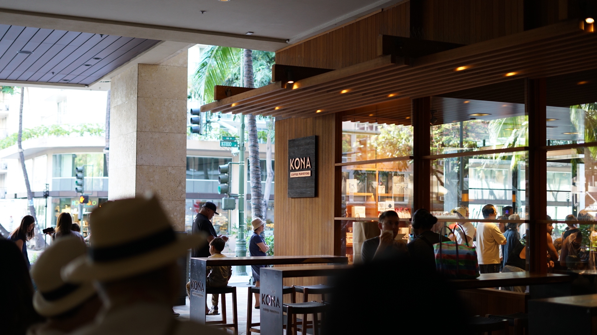

# 2023-06-18

Allyanna and I arrived in Oahu Hawaii on the 18th after a 6 hour flight. We were ecstatic to be greeted with some leis and a chance to stretch our legs.

As we were waiting for our transport from the airport to White Sands Hotel, some chickens came marching through the seating area.

# 2023-06-19

After catching some 💤 we woke up bright and early to make our way to Kona coffee purveyors. Their coffee beans are grown and roasted in Hawaii and they have pastries prepared by a chef that has won the James Beard award. We went back a few more times for their pour overs and home made chai mixture.

From there we went to the Waikiki beach to catch some rays. We found ourselves a spot on the beach and made our way out to ride some waves before enjoying the feeling of the sand under our feet while laying out on some towels.

# 2023-06-20

On Tuesday, Allyanna went out to catch up with her friend Danielle. We decided to split up so she could spend some one-on-one time as it had been a while since they had seen each other. After a morning of journaling and reading, I made my way out to the "Soul Tree" as it's named to find a geocache. One of the streets was lined with these gnarled trees. They provided well needed shade and a beautiful view from below.

After Allyanna made her way back from reconnecting with Danielle, we went out for dinner. The modern Hawaiian culture is heavily influenced by Asian culture so there is a wonderful variety of Asian cuisine to choose from. Boise doesn't have much of a selection for ramen so it was a nice change.

On the way to the ramen shop, we took a moment to appreciate the beautiful sunset along a canal that ran parallel to the first part of the path on our journey.

As we continued down the canal we heard the songs of many different birds across the river. Near the point where the path turned away from the canal, we spied a Kingfisher walking on the shore.

While the service wasn't the most Americanized version of service with a smile, the food was still delightful. On the way back from the ramen shop to the hotel we took the opposite side of the road and stumbled upon a kitty in a vacuous well light room. It turns out it was a cat cafe that was closed after hours.

# 2023-06-21

On Wednesday, Allyanna and I journied to Hanauma Bay. The bay is home to many different types of coral reef and a staggering variety of fish species. Allyanna and I were able to get our hands on some snorkeling gear. We spent about two hours snorkeling. The water was pristine and the moment we stuck our heads into the water fish were visible in all directions. We must have seen at least 30 different species of fish within that timeframe.

The park closed around 3pm so we hiked our way back up to the entrance from the bay. As we were awaiting our Uber driver, we heard a faint mewing sound from above. It turned out to be one of the local cats relaxing in the tree above the bench we were sitting on.

Time flew by so quickly while snorkeling that we didn't realize how tired the activity had made us. By the time we got back to the hotel the both of us lay down for a few minutes only to realize that we had slept until 9pm.

# 2023-06-22

Today breakfast was calling our name. On our way out to the destination the wind picked up and a rare bro BUH-LOCK-EH made his way out onto the scene. You gotta flip that cap for aerodynamics am I right?

Once we arrived Allyanna was having some difficulty with the variety of choices that lay before her.

After a short homework session, we rode to Don Quijote's which is a Japanese grocery chain.

They had all sorts of Asian cuisine and products, even some Filipino goods!

We were intrigued by tablets that were mounted in the sake section of the grocery store. They turned out to be the hardware for a sake recommendation app. The basic premise was that you answered a few questions about what type of experience you wanted when drinking and it would spit out a trio of recommendations. It was a cool idea in concept except it recommended sake that wasn't for sale in the store.

