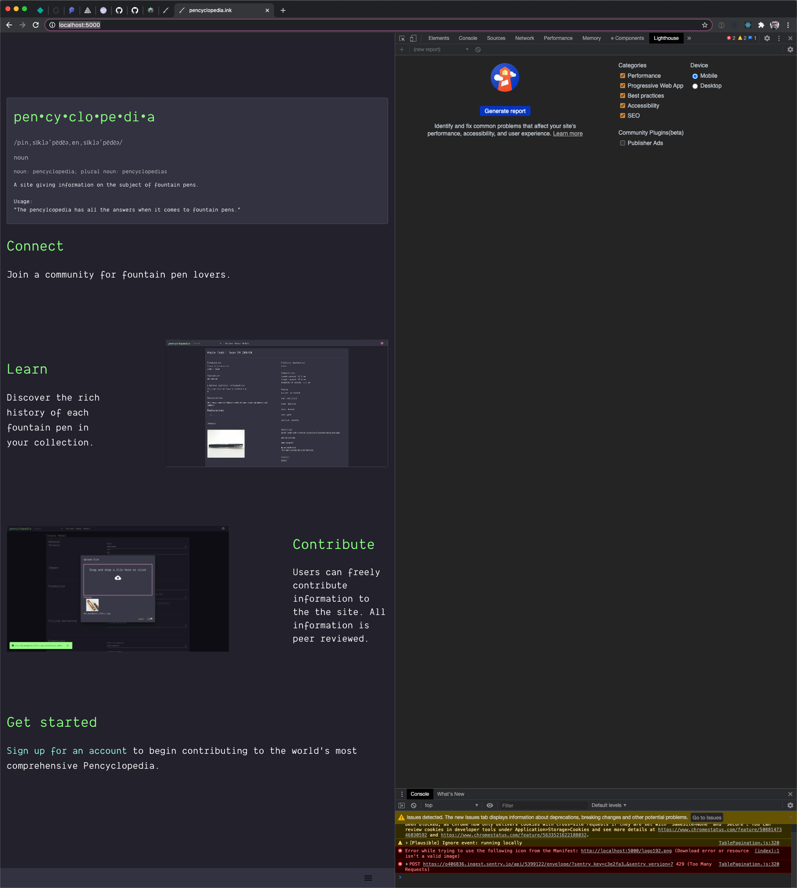

## One size does not fit all

Application requirements vary tremendously from one application to another. This guide is not meant to be a prescriptive
 set of steps that anyone can apply to any single page application. This is a high level guide that gives you a few
 helpful tips and some starting points to guide you along your own journey to a more performant application.
 
For this guide we'll be analyzing performance for https://pencyclopedia.ink. This is a personal SaaS project that I've
 launched, so it's a little more real world than your usual tutorial. You'll learn about using [Lighthouse][lighthouse] 
 to analyze application performance along with a couple of practices for improving React application performance.

### Make your production build

First we'll need to make sure that the application binary is as close to the production build as possible. We don't want
development scripts to impact performance analysis. To do so, we'll use the `build` 
command that was seeded by [CRA][cra] for this project. This creates a production ready asset that you can then 
distribute.

```bash
# from the project root
# note: this assumes that application dependencies have already been installed via npm already
npm run build
# Install a static file server locally
npm i -g serve
# Serve your production assets locally
serve -s build
```


Above, we first run the build command to create the assets. We then install [serve](https://www.npmjs.com/package/serve)
which is a local static file server. From there the static file server is run locally to serve the built assets. This is 
what Lighthouse is going to be running the analysis against. Of course, you could always run this against your 
production site, but that makes iterating more cumbersome.

### Use Lighthouse to find bottlenecks

First of all, you need to identify if your application has any performance issues. Chrome has a built in tool called 
Lighthouse that you can leverage to identify specific performance bottlenecks. To use Lighthouse, open Google Chrome
and do the following:

1. Navigate to the local file server's address
1. Open Chrome dev tools
1. Look for the Lighthouse tab



Lighthouse is ridiculously powerful. Learn more about what it does and how to use it [here](lighthouse).

The simplest way to get started is to click "Generate report".

Once the report is generated, you'll see a high level breakdown of how your app performance at the top of the window.


Judging from the report, there are some big offenders here. 30.9s could be shaved off by removing a big gif. Another 
image based critique is given. These are relatively simple fixes that we'll ignore for the sake of focusing on React
specific performance improvements.

First we'll focus on unused javascript as this will impact almost every React based app. Clicking on that tab yields the 
following:


The first thing that jumps out to is that React dev tools are being included in the bundle. For development builds this
 makes sense, however, for production I'm a bit surprised that this is CRA's default behavior. That's a whole 444.4KB 
 that can be shaved off of the app bundle.

After doing some searching, I found that there's a Github link for removing React dev tools from production assets.

You can add the following to your `index.html` to disable it.

```html
<body>
  <noscript>You need to enable JavaScript to run this app.</noscript>
  <div id="root"></div>
  <% if (process.env.NODE_ENV === 'production') { %>
  <script>
    // before React is loaded
    if (typeof window.__REACT_DEVTOOLS_GLOBAL_HOOK__ === "object") {
      __REACT_DEVTOOLS_GLOBAL_HOOK__.inject = function() {}
    }
  </script>
  <% } %>
  <!--
      This HTML file is a template.
      If you open it directly in the browser, you will see an empty page.

      You can add webfonts, meta tags, or analytics to this file.
      The build step will place the bundled scripts into the <body> tag.

      To begin the development, run `npm start` or `yarn start`.
      To create a production bundle, use `npm run build` or `yarn build`.
    -->
</body>
```

This fix is using the ejs templating language to programmatically exlucde the React dev tools hooks for production.

Alright, let's generate a new report and see what that new score is!


Wow! The performance score went from 36 to 43. That's great, but, we can do better. Looking at the next big ticket item 
that's javascript related, we have the "Remove unused javascript" section.


Lighthouse is so powerful that it even picks up on project frameworks and gives you smart recommendations.

After doing some reading I found that the React docs recommend starting at the [route level](route-level) to leverage 
code splitting. This turned out to work well with my project because I'm utilizing `react-router-dom` for the routing 
mechanism anyway. The documentation recommends leveraging `suspense` along with `lazy` and dynamic `import` to 
implement code splitting.

Here's what the code looks like before and after:


Anything that was a top level route component was converted from the ESmodule `import` to use `lazy` and dynamic `import`
instead.

You'll also need to wrap all of your router routes in the `Suspense` component as well.


Running `npm run build` now shows a different output from before.


Previously there were 3 different chunks. As you can see there's quite a few more after this change, and this is exactly 
what we want. Leveraging code splitting, the application is able to separate parts of our application into separate 
assets. These assets are only loaded when the application requires them at runtime. This allows for reducing overall 
asset sizes which helps to improve load times for network constrained clients.

So, what's our new score?


89! It's not perfect, but we're getting there! Leveraging code splitting, our score jumped 46 points in total, which
 is pretty impressive considering the amount of effort that was required to do so. This change puts the application on 
 the edge of a good rating.
 
 And for now, we'll leave it at that. It should be noted, that although the changes made in this walkthrough do impact
  site wide load times, you'll need to run Lighthouse for each page in your application and assess the root cause of 
  performance issues accordingly.


## References

[lighthouse]: https://developers.google.com/web/tools/lighthouse
[gh-191]: https://github.com/facebook/react-devtools/issues/191
[react-suspense]: https://web.dev/code-splitting-suspense/?utm_source=lighthouse&utm_medium=devtools
[route-level]: https://reactjs.org/docs/code-splitting.html#route-based-code-splitting
[cra]: https://reactjs.org/docs/create-a-new-react-app.html

1. [Lighthouse](lighthouse)
1. [Removing dev tools issue](gh-191)
1. [React.lazy()](react-suspense)
1. [Route based code splitting](route-level)
1. [Create react app][cra]
