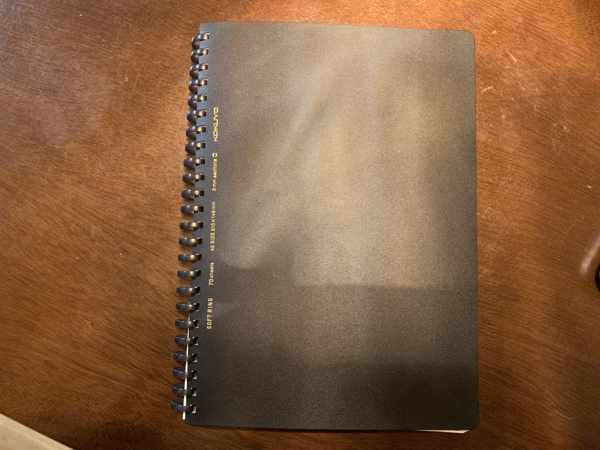
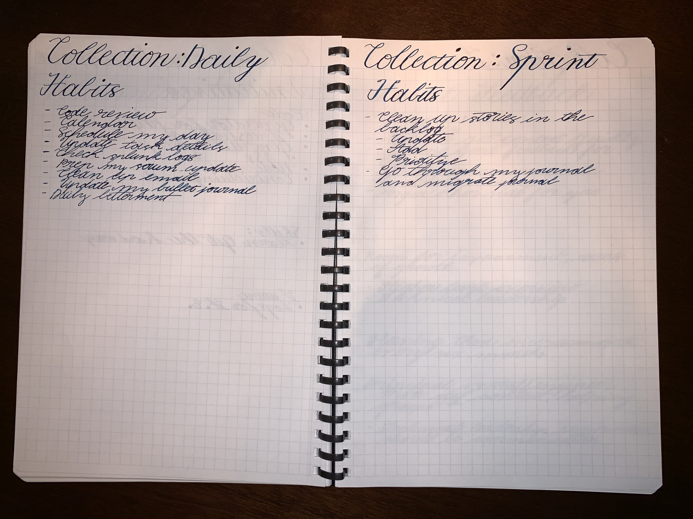
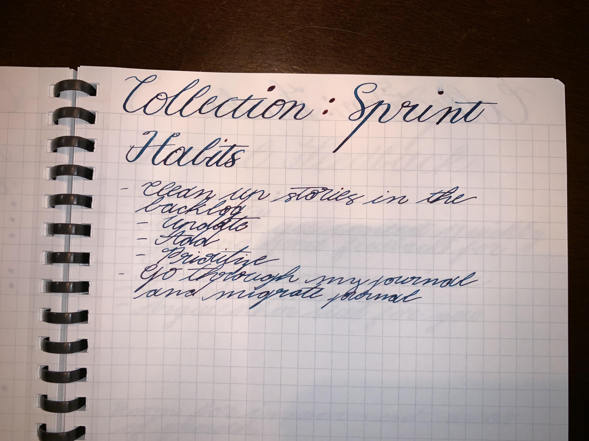
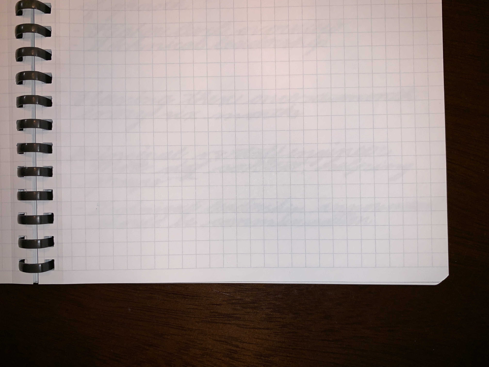

## Product

The product I'll be reviewing today is the Kokuyo soft ring A5 notebook with a black cover and black soft rings.

### Specs

| Attribute                                        | Description              |
| ------------------------------------------------ | ------------------------ |
| Paper dimensions                                 | A5 paper (210x148mm)     |
| Cover                                            | Lightly textured plastic |
| Binding                                          | Soft plastic ring        |
| Notebook depth (including front and back covers) | 9.75mm                   |
| Feathering                                       | No                       |
| Bleed through                                    | No                       |
| Page numbers                                     | No                       |
| Index                                            | No                       |

### Where you can get it

I didn't see this in the usual locations such as amazon or jetpens. I did however find the notebook on sale at [tokyopenshop.com](https://www.tokyopenshop.com/notebooks-c-2/kokuyo-soft-ring-business-grid-a5-p-1856.html). I have not purchased anything from this site, so your mileage may vary.

## Paper

### Quality

The paper was a pleasure to work with. It's smooth and durable and does not bleed or feather when a fountain pen is used on it. If I were to put the paper on a quality scale, it sits somewhere between Kokuyo Campus notebooks and Kokuyo MIO paper. The paper is just not as smooth as MIO which is to be expected considering that MIO is the top end of Kokuyo's paper offerings.

The paper is perforrated to allow you to remove an individual page. While this can be useful, I haven't found myself needing this feature. Sometimes, with perforrated pages if you're not careful where you put the notebook, pages can begin to tear themselves out. This was not the case for about three and a half months of use with this notebook.

### Layout

The journal has grid paper with room for a title and date. The grid has a dimension of 38 squares in height by 28 squares wide. Squares are 5x5mm in dimension. Due to perforration, there are only 27 usable squares.

### Dimensions

Since the notebook paper is A5, pages are 210x148mm in dimension. Perferration leaves 139mm in width for usable space on the page.

14.3mm are used for title height at the top of the page. This leaves 195.7mm left over for which 195mm is gridded. The .7mm leftover is left as margin.

## Binding

The notebook has a cover on the front and back. This color is a flexible plastic that is quite durable. The rings are made up of a soft, translucent plastic.

## Bullet journaling

I quite like this notebook for bullet journaling. The soft rings were a departure in comparison to using sewn bindings in other notebooks. Having the ability to fold over to a single page makes it nice to use with daily task lists. I just feel more focused when I only have a single page to look at. Since I started using this notebook, I have wanted ring bindings in my other journals.

I'm not a big fan of the title space. It would prefer to have the title area mirror the bottom of the page instead. For single page layouts it can be nice, but for layouts that may include multiple different sections, it feels like wasted space.

This was my work bullet journal for the last three months. I primarily use collections and a daily spread. I don't use much else of the typical bullet journal layouts like month, or weekly spreads, so I don't have much to say in regards to two page layouts.

I also don't use page number based indexing, so the lack of page numbers didn't bother me, however that could be a pain if you use numbers for your bujo. There are also no pre-created index pages.
