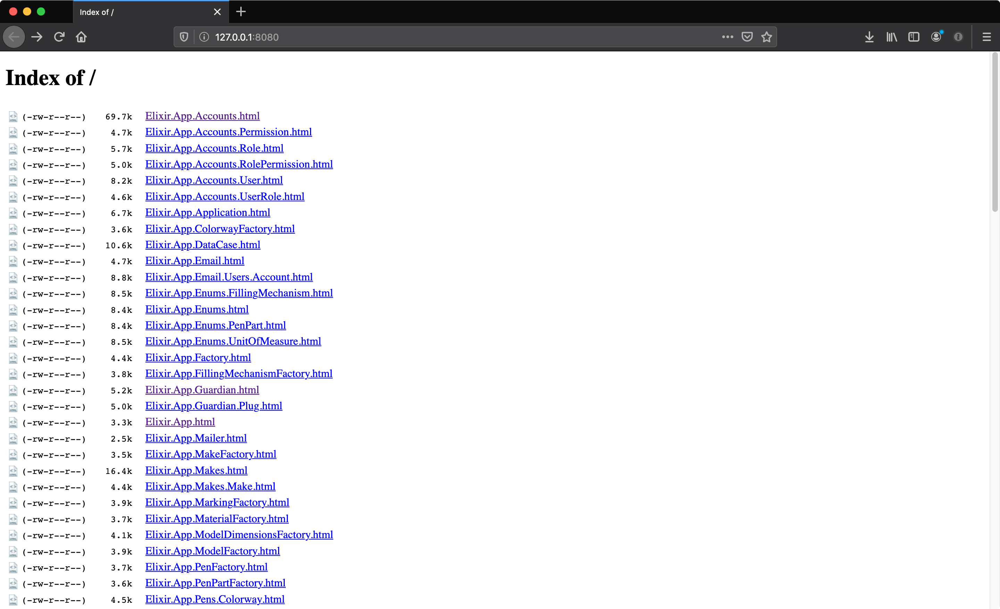
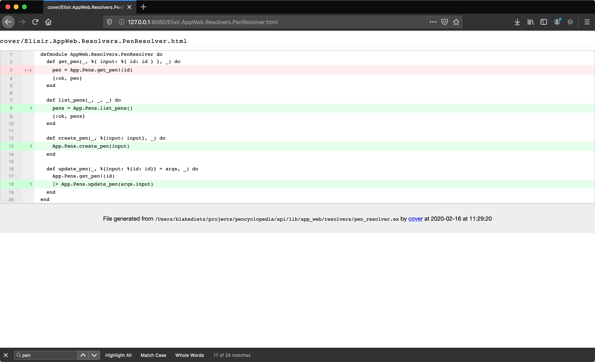

## Elixir

### Tests

I've been working on a personal project in my spare time and I've been focusing on writing unit and integration tests. I've probably spent more time writing tests than I have writing features for it. The main reasoning being that the current professional project I'm working on doesn't have tests so I want to help improve the codebase by adding testing support. I found out that elixir has built in test coverage reporting. It's just a `mix test` flag.

```elixir
mix test --cover

.................................................

Finished in 1.1 seconds
52 tests, 2 failures

Randomized with seed 760706

Generating cover results ...

Percentage | Module
-----------|--------------------------
   100.00% | App
     0.00% | App.Accounts
     0.00% | App.Accounts.Permission
     0.00% | App.Accounts.Role
     0.00% | App.Accounts.RolePermission
     0.00% | App.Accounts.User
     0.00% | App.Accounts.UserRole
    75.00% | App.Application
   100.00% | App.ColorwayFactory
     0.00% | App.DataCase
     0.00% | App.Email
     0.00% | App.Email.Users.Account
   100.00% | App.Enums
   100.00% | App.Enums.FillingMechanism
   100.00% | App.Enums.PenPart
   100.00% | App.Enums.UnitOfMeasure
    76.92% | App.Factory
   100.00% | App.FillingMechanismFactory
     0.00% | App.Guardian
     0.00% | App.Guardian.Plug
     0.00% | App.Mailer
   100.00% | App.MakeFactory
    57.14% | App.Makes
   100.00% | App.Makes.Make
   100.00% | App.MarkingFactory
   100.00% | App.MaterialFactory
   100.00% | App.ModelDimensionsFactory
   100.00% | App.ModelFactory
   100.00% | App.PenFactory
   100.00% | App.PenPartFactory
    49.21% | App.Pens
   100.00% | App.Pens.Colorway
   100.00% | App.Pens.FillingMechanism
   100.00% | App.Pens.Marking
   100.00% | App.Pens.Material
   100.00% | App.Pens.Model
   100.00% | App.Pens.ModelDimensions
   100.00% | App.Pens.Pen
   100.00% | App.Pens.PenPart
     0.00% | App.Pens.PenPartMaterial
   100.00% | App.PermissionFactory
    50.00% | App.Repo
   100.00% | App.UserFactory
     0.00% | AppWeb
    71.43% | AppWeb.AbsintheHelpers
    16.67% | AppWeb.AbsintheSocket
     0.00% | AppWeb.ChannelCase
   100.00% | AppWeb.ConnCase
    50.00% | AppWeb.Context
     0.00% | AppWeb.Data
   100.00% | AppWeb.Endpoint
     0.00% | AppWeb.ErrorHelpers
     0.00% | AppWeb.ErrorView
     0.00% | AppWeb.Gettext
   100.00% | AppWeb.Resolvers.ColorwayResolver
   100.00% | AppWeb.Resolvers.FillingMechanismResolver
   100.00% | AppWeb.Resolvers.HelloResolver
   100.00% | AppWeb.Resolvers.MakeResolver
   100.00% | AppWeb.Resolvers.MarkingResolver
   100.00% | AppWeb.Resolvers.MaterialResolver
   100.00% | AppWeb.Resolvers.ModelDimensionsResolver
   100.00% | AppWeb.Resolvers.ModelResolver
    75.00% | AppWeb.Resolvers.PenPartResolver
    75.00% | AppWeb.Resolvers.PenResolver
     0.00% | AppWeb.Resolvers.PermissionResolver
     0.00% | AppWeb.Resolvers.RoleResolver
     0.00% | AppWeb.Resolvers.UserResolver
    75.00% | AppWeb.Router
     0.00% | AppWeb.Router.Helpers
   100.00% | AppWeb.Scehma.Middleware.Authorize
   100.00% | AppWeb.Schema
   100.00% | AppWeb.Schema.Mutations.Colorway
   100.00% | AppWeb.Schema.Mutations.FillingMechanism
   100.00% | AppWeb.Schema.Mutations.Make
   100.00% | AppWeb.Schema.Mutations.Marking
   100.00% | AppWeb.Schema.Mutations.Material
   100.00% | AppWeb.Schema.Mutations.Model
   100.00% | AppWeb.Schema.Mutations.ModelDimensions
     0.00% | AppWeb.Schema.Mutations.Pen
   100.00% | AppWeb.Schema.Mutations.PenPart
   100.00% | AppWeb.Schema.Mutations.Permission
   100.00% | AppWeb.Schema.Mutations.Role
   100.00% | AppWeb.Schema.Mutations.User
   100.00% | AppWeb.Schema.Queries.Colorway
   100.00% | AppWeb.Schema.Queries.FillingMechanism
   100.00% | AppWeb.Schema.Queries.Hello
   100.00% | AppWeb.Schema.Queries.Make
   100.00% | AppWeb.Schema.Queries.Marking
   100.00% | AppWeb.Schema.Queries.Material
   100.00% | AppWeb.Schema.Queries.Model
   100.00% | AppWeb.Schema.Queries.ModelDimensions
     0.00% | AppWeb.Schema.Queries.Pen
   100.00% | AppWeb.Schema.Queries.PenPart
   100.00% | AppWeb.Schema.Queries.Permission
   100.00% | AppWeb.Schema.Queries.Role
   100.00% | AppWeb.Schema.Queries.User
   100.00% | AppWeb.Schema.Types.Colorway
   100.00% | AppWeb.Schema.Types.FillingMechanism
   100.00% | AppWeb.Schema.Types.Make
   100.00% | AppWeb.Schema.Types.Marking
   100.00% | AppWeb.Schema.Types.Material
   100.00% | AppWeb.Schema.Types.Model
   100.00% | AppWeb.Schema.Types.ModelDimensions
   100.00% | AppWeb.Schema.Types.Pen
   100.00% | AppWeb.Schema.Types.PenPart
   100.00% | AppWeb.Schema.Types.Permission
   100.00% | AppWeb.Schema.Types.Role
   100.00% | AppWeb.Schema.Types.User
     0.00% | AppWeb.UserSocket
-----------|--------------------------
    46.84% | Total

Generated HTML coverage results in 'cover' directory
```

Also, if you notice at the bottom it even generates html docs. I just used [http-server](https://www.npmjs.com/package/http-server) to launch a local http server for the `cover` directory.

```bash
npx http-server ./cover
```

Here you can see that the coverage report creates an html file per each file in your app.



Here's an example of the coverage report for a file.



## Sources

[cover]: https://til.hashrocket.com/posts/jjft6nt871-viewing-your-test-coverage-in-elixir

1. [Exunit test coverage][cover]
