This tutorial aims to get you up and running from zero to a fully hosted kubernetes cluster managed by Argo CD hosted by 
Digital Ocean. Please be careful following these instructions as I have very little foundational knowledge in regard to
K8s. With that in mind, this guide is mainly focused on mechanics instead of imparting a deeper understanding. I 
just found that it was frustrating to navigate both learning the fundamentals and becoming productive at the same time
and would like to make a guide that you can read from start to finish.

Digital Ocean is the platform of interest for this post because it's both cheap and friendly. For only \$20 a month you 
can run a cluster with two decent sized nodes. Tack on a load balancer and you're spending \$30 a month for a cluster to 
put all of your pet projects to share with the world. In comparison to platforms like AWS, that's less than half the 
price.

## Prerequisites

### Operating system

This guide is targeted at macOS. There are specific usages of commands that are typically only available on macOS such
as `pbcopy`. If you're diligent though, you could apply most of the commands in this guide to a majority of linux
distributions. As for windows, 🤷.

### Accounts

- Digital Ocean

[comment]: <> (- GitHub)

### Utilities

- brew: used to install packages
- Helm: used to install Helm repositories
- doctl: used to manage the digital ocean kubernetes services and cluster
- kubectl: used to manage the kubernetes cluster

## A word on security

Yes, the gifs (say it with me GEH-FSSS not JEEEEFFSS) in this tutorial do include sensitive information. I am aware 
that both ssh keys and passwords are visible. My primary concern is to make this guide as user-friendly as possible. 
The keys used in this tutorial are no longer valid and thus don't pose a security risk for my current deployments.

With that said the tutorial assumes that you leave the base password in place until the tutorial is complete. This
is merely the case in order to make the tutorial simpler with more prescriptive commands. Once you are done make
sure to set the password for admin for Argo CD.

## Spin up the cluster

Go to digital ocean and click
- Create
- Kubernetes

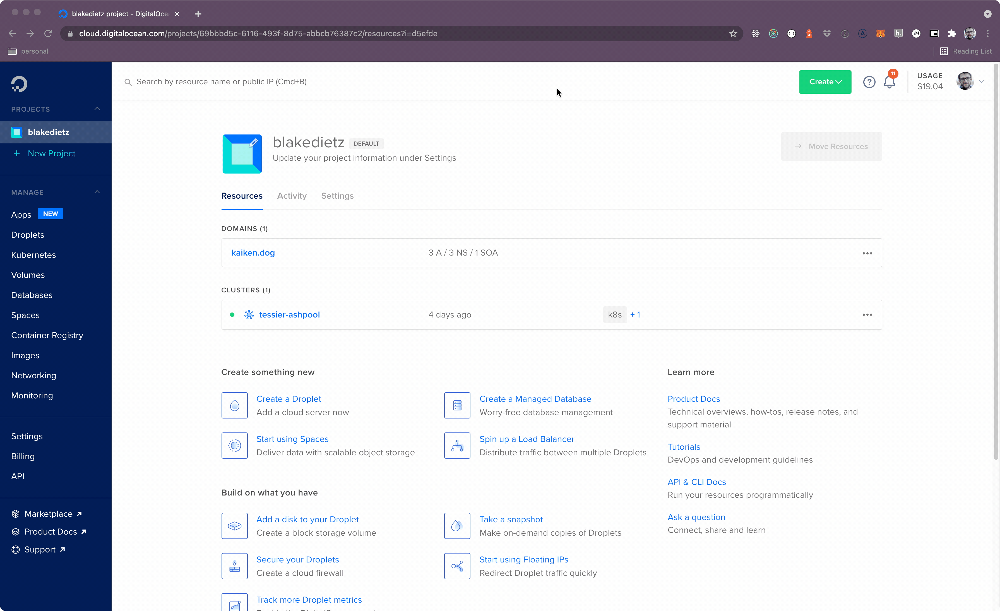

Specify the following in the ui

### Data center region

- Pick whatever you prefer

### Node plan

- Machine type: Basic nodes
- Node Plan: \$10 Month per node
    
### Node pool name

- Whatever you like

### Cluster name

- Whatever you like
    


## Your cluster is now being created


## Walk through the getting started guide

### Section 2

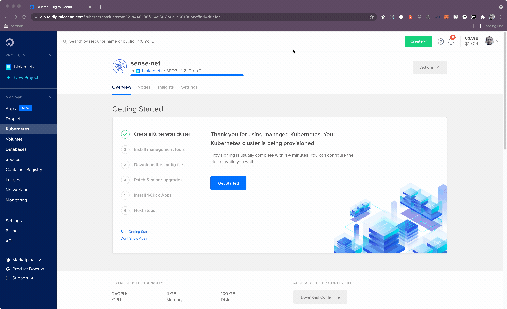

### Section 3 

Download the config file and copy the `doctl` command that they specify.

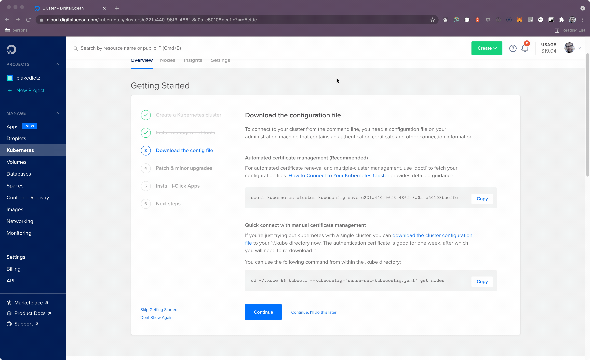

Use the command in your terminal of choice.

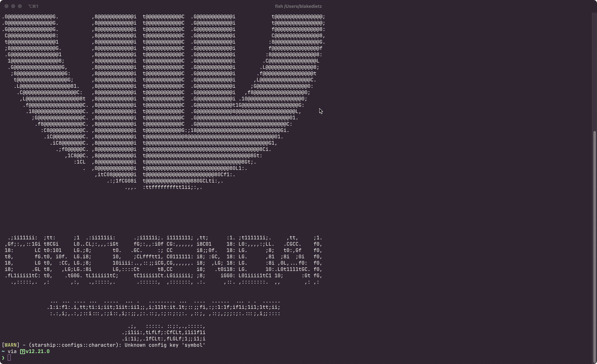

### Section 4

Set your Patch and minor upgrade preferences
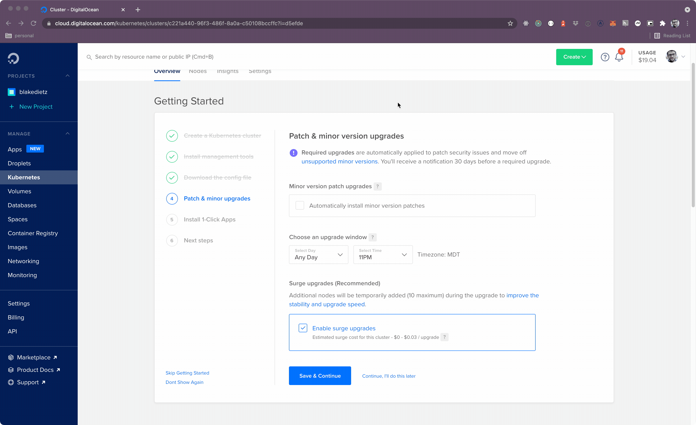

### Section 5

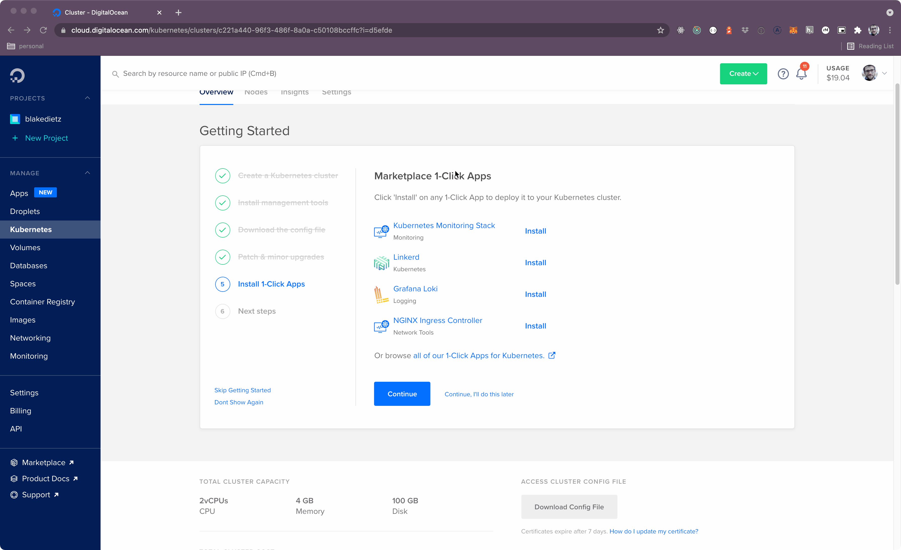

### Section 6

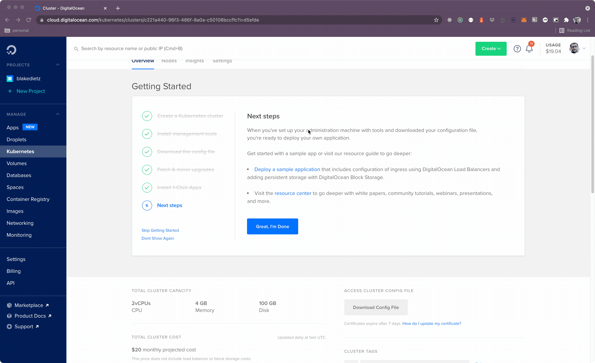

## Install Argo CD

For this next section we'll follow along with the Argo CD getting started guide

### Apply Argo CD manifests with kubectl

```bash
kubectl create namespace argocd
kubectl apply -n argocd -f https://raw.githubusercontent.com/argoproj/argo-cd/stable/manifests/install.yaml
```

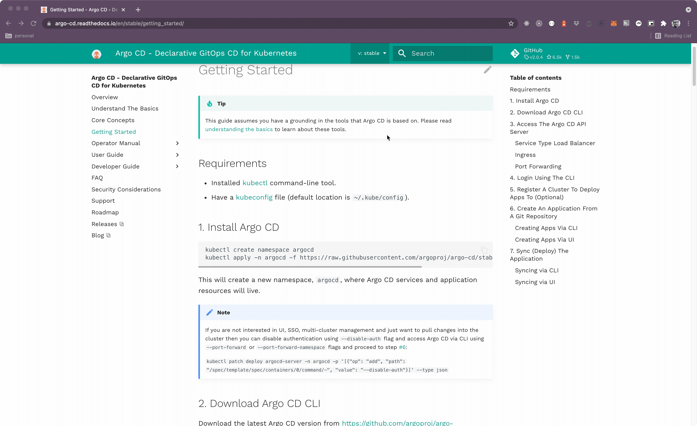


### Download ARGO CD CLI

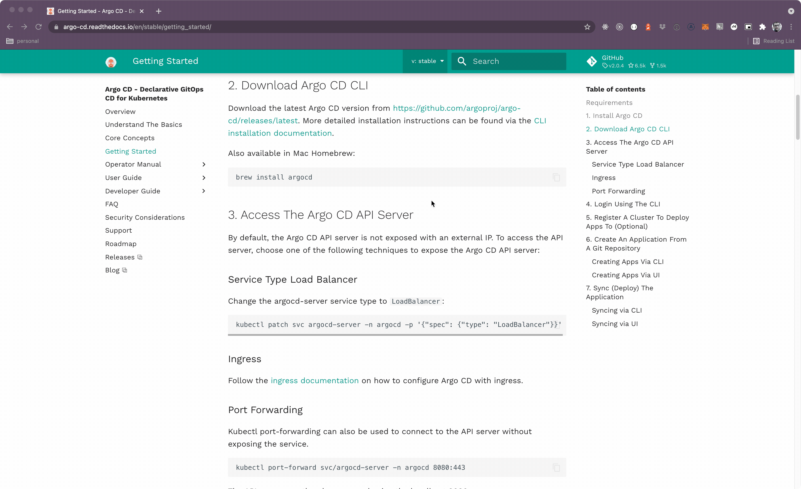

### Access The Argo CD API Server

#### Forward from your pods to your localhost

To keep things simple we'll initially use port forwarding to access the Argo CD dashboard. The command for doing so
is as follows:

```bash
kubectl port-forward svc/argocd-server -n argocd 8080:443
```

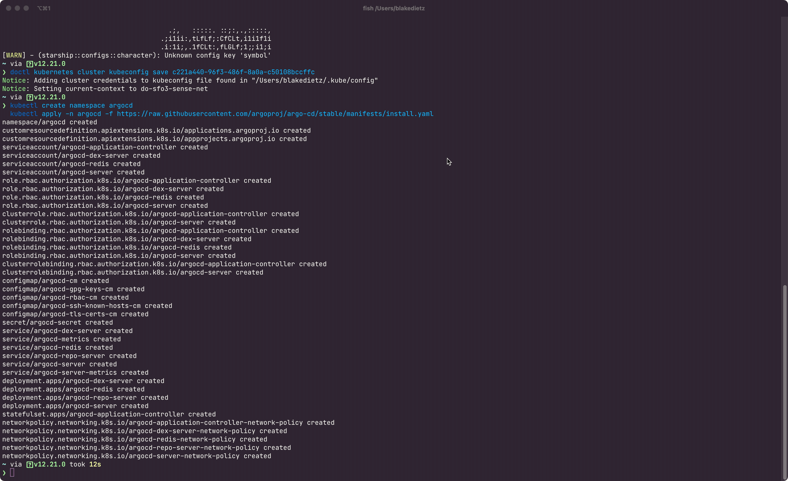

Check your local server by opening up a browser session and visiting https://localhost:8080. At this point you
should see that the Argo CD dashboard is visible.

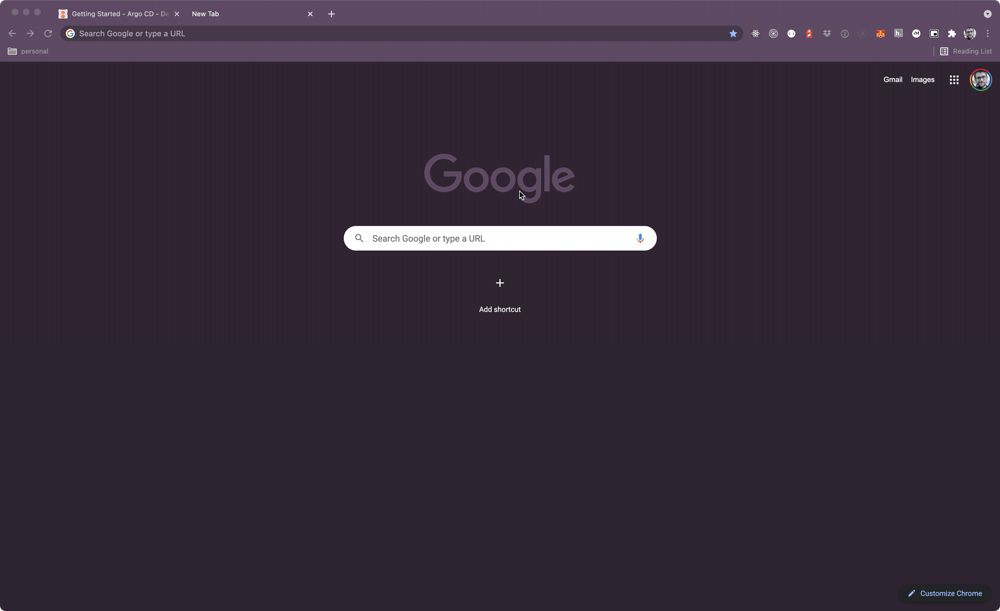

#### Login to the Argo CD dashboard

Once created, by default, (if you're using argocd at v1.9 and later) Argo CD creates a temporary password for 
logging in to both the UI as well as from the interface. To access the password we'll do the following:

```bash
# copies the password onto your clipboard
kubectl -n argocd get secret argocd-initial-admin-secret -o jsonpath="{.data.password}" | base64 -d | pbcopy
```


With the password on your clipboard login with a username of admin.

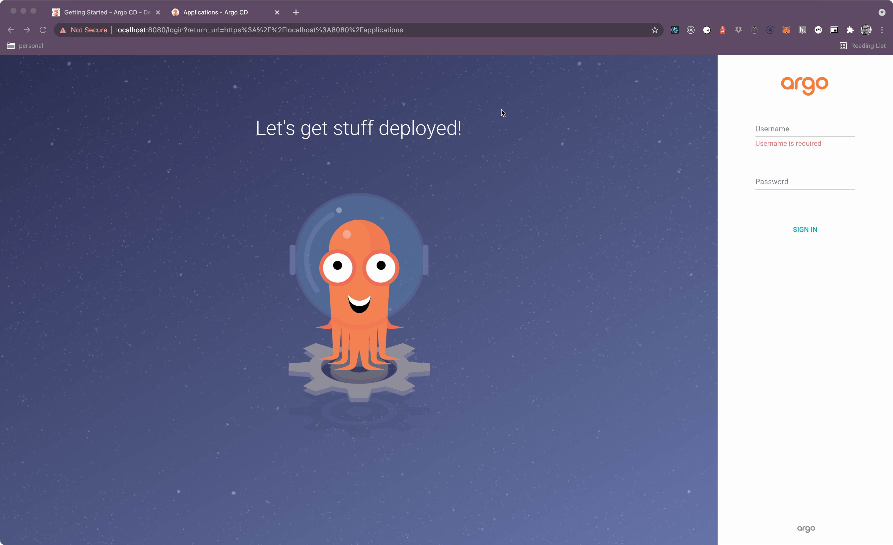


And that's it! At ths point you should have a cluster with two nodes being managed by Argo CD. In the next part
we'll add a way to deploy an actual app and aim to expose that app to the rest of the world. Stay tuned, for part two.
