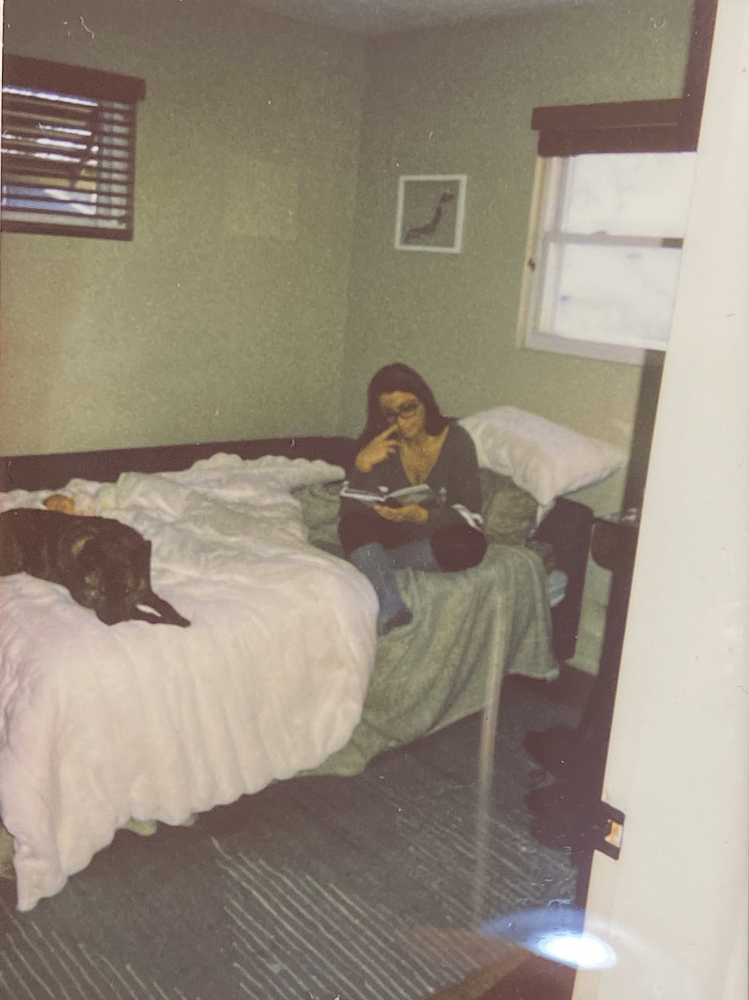
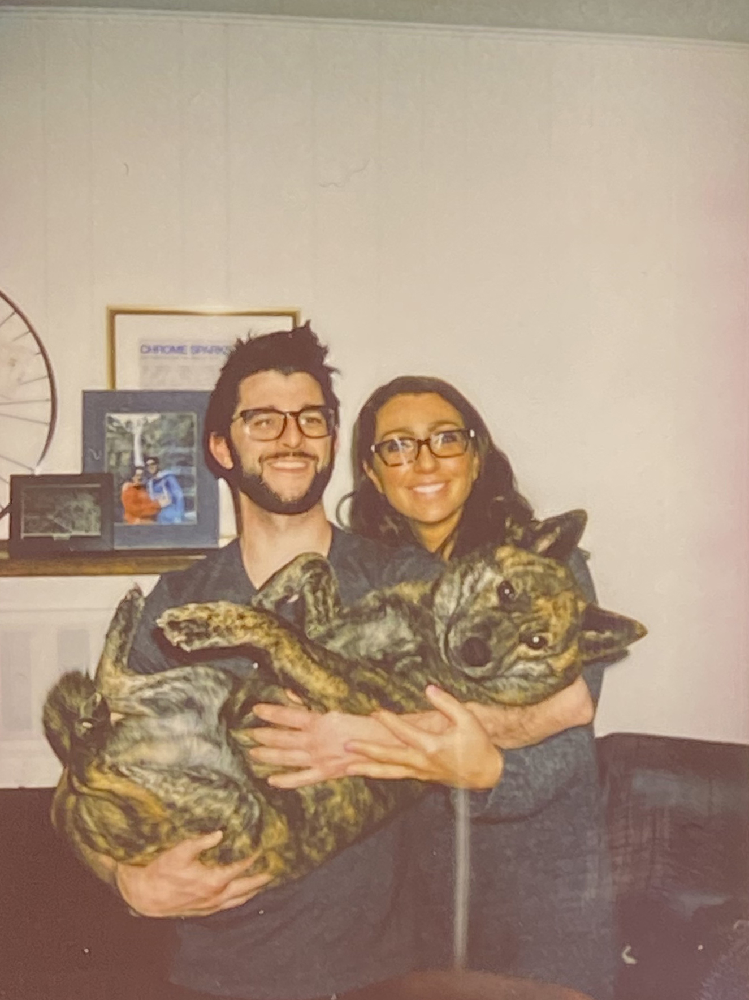
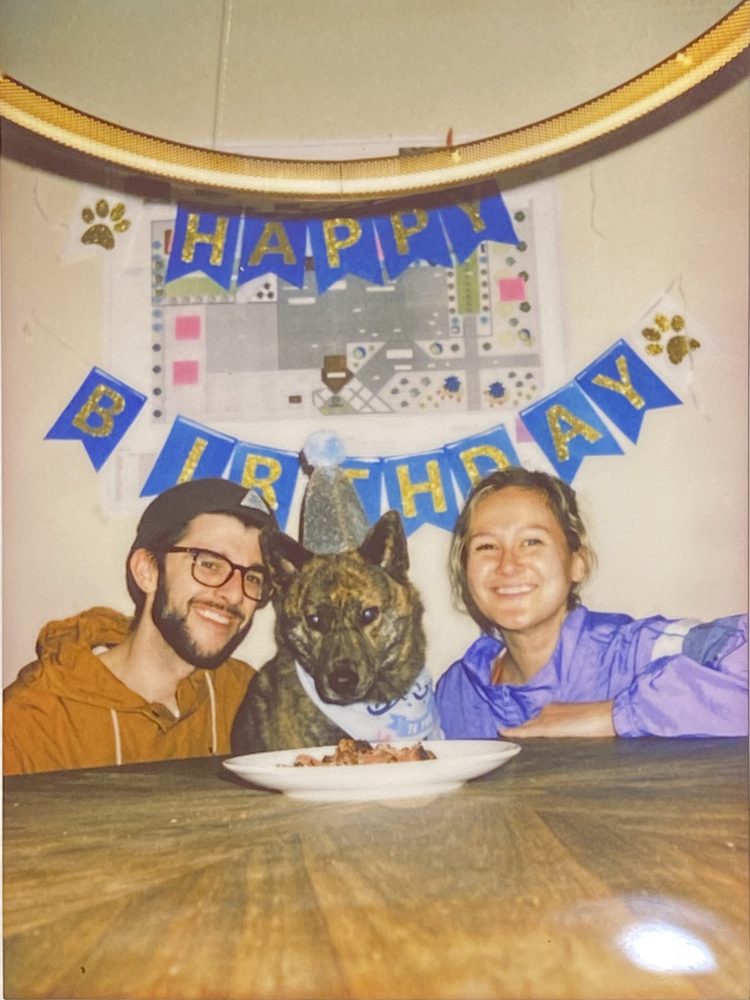

## What I'm thinking about

### Family

#### Jessica

My older sister Jessica spent her time in Idaho from 2022/01/20 until 2022/01/30 visiting. She stayed with Allyanna and I for the most part with some visits to Fruitland as well as to her new granddaughter's house.

It was a nice opportunity to catch up with my middle sister. There have been so many miles and so many years between us; to say I missed her doesn't quite describe  the hole in my heart. The most beautiful part about having that hole temporarily filled was how easily we fell back together. There were plenty of late nights of stories from the both of us and an unhealthy amount of wine consumption to boot.

Thankfully we were able to catch a few moments while she was here.

I had the pleasure of showing her a book that my dad had mostly filled out. It has a question and answer format about various formative and seemingly trivial aspects of his life. I caught her perusing the book while she was watching over my new great niece Maya alongside her newfound friend Velo.

This photo is dear to me as it shows some of the essence of my sister, a person whom I'm both familiar and estranged to. She sits learning, empathising with our father, one of the most important models in our life while simultaneously watching over her new grand daughter Maya. Yet another beautiful aspect is the evidence of the newfound bond she's made with Velo. Throughout the trip I saw these strange parallels between her and I through her interactions with Velo and in turn our relationship with our dad.

Dad taught us the importance of connecting with nature. Whether it was through having us do things that we didn't necessarily want to do for example, crawling on my hands and knees in a potato storage to catch some tiger salamanders or by taking awe in the minutia in nature by simply admiring the beauty of a beetle's pearlescent wings centred in his work-worn hands.

I was gobsmacked when I saw Jessica play with Velo. It was like looking in a mirror. Jessica would rile Velo to the point of zoomies and then run and hide only to jump out as he made his rounds through the house. I've never seen anyone else play with a dog like I do; like my dad did.

The photo above was taken right before she left our household on the 29th. I can't put into words how I felt the day after she left.

### Velo's 4th birthday

Our dog Velo a Kai Ken had his fourth birthday. We cooked him some filet mignon (a little more well than I had hoped) and took him down to The Stil for a scoop of eggnog ice cream.

## What I'm working on

i took a break this week from my side projects to focus on time with my sister.

## What I'm reading

### Wanting: The Power of Mimetic Desire in Everyday Life

[Amazon]

## What I'm watching

## What I'm listening to

### Shortwave memories

<iframe src="https://open.spotify.com/embed/album/67qmzR9XdcpPAoqBJIgzdy" width="100%" height="380" frameBorder="0" allowtransparency="true" allow="encrypted-media"></iframe>

### Ripped apparition

<iframe src="https://open.spotify.com/embed/album/3z3eAvhb2V8dpuOIDo8zQ9" width="100%" height="380" frameBorder="0" allowtransparency="true" allow="encrypted-media"></iframe>

### Wuthering drum

<iframe src="https://open.spotify.com/embed/album/035KrNkVSdgjUkIBIZkeT9" width="100%" height="380" frameBorder="0" allowtransparency="true" allow="encrypted-media"></iframe>
