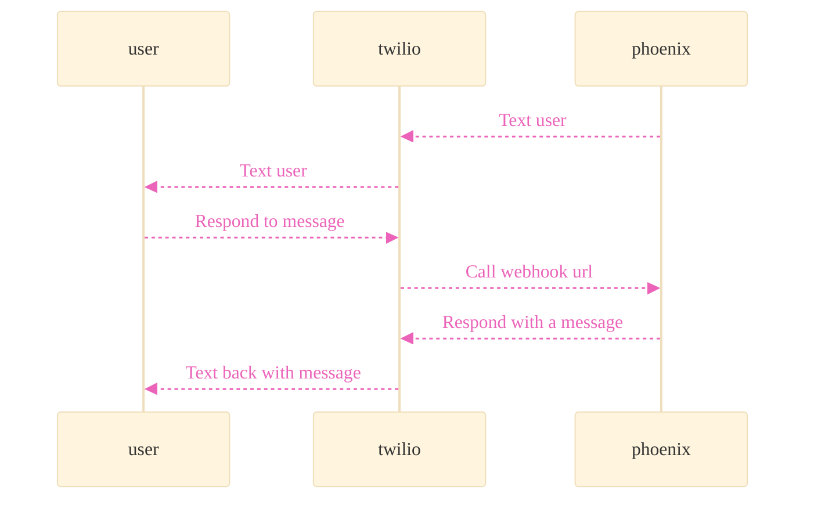

## Background

While working through some of the [ex_twilio documentation](https://github.com/danielberkompas/ex_twilio/issues/135), I couldn't find any specific examples of how to respond to incoming text messages. I was surprised to see such a basic example missing from the documentation. After a little digging I was able to create a simple solution.

This article will walk through how to send and respond to SMS messages from twilio via Phoenix and ex_twilio.

## Overview



## Send messages from Phoenix

### Set up twilio

You'll first need to sign up for a twilio account. Once created get a hold `TWILIO_ACCOUNT_SID` and `TWILIO_AUTH_TOKEN` as well as the associated number that was granted.

Save these for a later step.

### Create a Phoenix project

In order to receive messages from twilio we'll need to set up a REST endpoint. The endpoint will be called whenever the SMS webhook is called.

```bash
mix phx.new app
cd app
# Install deps and set up postgres
mix setup
```

### Install twilio specific deps

Add the following deps to your `mix.exs` file.

```elixir
  # mix.exs
  #...
  defp deps do
    [
      # ...
      # Library for working with twilio apis
      {:ex_twilio, github: "danielberkompas/ex_twilio"},
      # Library for creating TwiML from elixir macros
      {:ex_twiml, "~> 2.1"}
    ]
  end
  # ...
```

Then run `mix deps.get` to install the given deps.

### Export your twilio credentials to your shell environment

I recommend that you set these variables as environment variables. I use [direnv](https://direnv.net/) for this purpose, but you can do so manually or with whatever tools you prefer.

```bash
# My .envrc file that is sourced by direnv at the root of the project.
export TWILIO_ACCOUNT_SID=<redacted>
export TWILIO_AUTH_TOKEN=<redacted>
```

### Configure ex_twilio

Update `config.exs` to pull the exported variables from the environment.

```elixir
config :ex_twilio, account_sid:   {:system, "TWILIO_ACCOUNT_SID"},
                   auth_token:    {:system, "TWILIO_AUTH_TOKEN"}
```

### Verify your ex_twilio configurations

Before we move further, let's make sure that the credentials and library configurations work as expected.

Start an interactive session and send your phone an SMS message.

```bash
iex -S mix phx.server
iex(1)> ExTwilio.Message.create(to: "+<your personal phone number>", from: "+<your twilio number>", body: "Hello world!")
```

At this point you should have received a message. If not, go back and make sure your configurations are in line.

## Receive messages from twilio in Phoenix

### Install twilio cli

[Follow the directions to install the twilio cli.](https://www.twilio.com/docs/twilio-cli/getting-started/install)

### Login to the twilio cli

[Follow the directions to login here.](https://www.twilio.com/docs/twilio-cli/general-usage)

### Configure your local machine to receive text messages

In order for your local machine to receive text messages run the following command.

```bash
twilio phone-numbers:update "+<your twilio phone number>" --sms-url="http://localhost:4000/sms_messages"
```

The key to the command above is the `--sms-url` param. This sets the incoming message webhook url to point to your local machine. Furthermore, this command sets up ngrok to make your local machine accessible from the internet in turn allowing twilio to send webhook requests to your computer.

### Create a rest endpoint to handle the incoming webhook

Create the file `app_web/controllers/sms_message_controller.ex` and add the following contents.

```elixir
# app_web/controllers/sms_message_controller.ex

defmodule AppWeb.SMSMessageController do
  use AppWeb, :controller

  def create(conn, params) do
    conn
    |> put_resp_content_type("text/xml")
    |> text(AnotherModule.render_response())
  end
end

# A second module within the same file is merely a shortcut. Feel free to add this to antoher file.
# The reason why this second module was included was due to the import ExTwiml statement. It brings a render/1 function into scope that overlaps with the Phoenix render/1 function.
defmodule AnotherModule do
  def render_response() do
    import ExTwiml

    # This TwiML module is required for the response as twilio expects TwiML https://www.twilio.com/docs/messaging/twiml for the body
    twiml do
      message do
        body("Hello world!")
      end
    end
  end
end
```

Update `router.ex` to include the following line.

```elixir
# ...
pipeline :api do
  plug :accepts, ["json"]
  # This is the line that should be added
  post "/sms_messages", AppWeb.SMSMessageController, :create
end
# ...
```

Now send a message to your twilio number from your phone. You should receive a response of "Hello world!".
