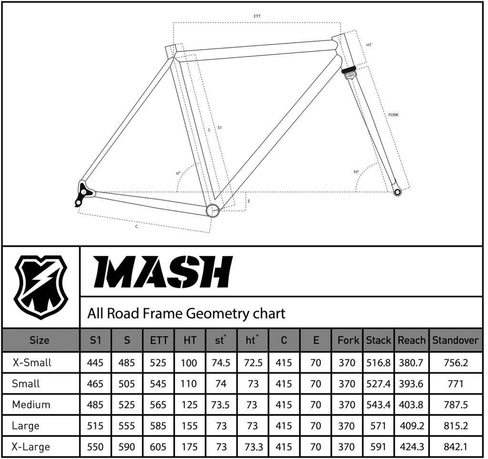

## Photos

Allyanna Wintermote took these photos while we were riding on the Hiawatha Trail in northern Idaho.

## Parts

<dl>
  <dt>Frame</dt>
  <dd>
    <dl>
    MASH steel all-road
      <dt>Frame</dt><dd>MASH Butted steel</dd>
      <dt>Fork rake</dt><dd>43 mm</dd>
      <dt>Seatpost size</dt><dd>27.2 mm</dd>
      <dt>Seat collar size</dt><dd>30.0 mm</dd>
      <dt>Headset spec</dt><dd>Traditional 1 1/8" headset</dd>
      <dt>Rear hub spacing</dt><dd>142 mm x 12 mm</dd>
      <dt>Front hub spacing</dt><dd>100 mm x 12 mm</dd>
      <dt>Disc mount style</dt><dd>Flat mount</dd>
      <dt>Cable routing</dt><dd>External</dd>
      <dt>Wheel size</dt><dd>700 c or 650 b</dd>
      <dt>Front derailleur</dt><dd>28.6 mm clamp on</dd>
      <dt>Max tire size</dt><dd>700 c x 38 mm or 650 b x 42 mm</dd>
    </dl>
  </dd>

  <dt>Crankset</dt>
  <dd>SRAM Rival 1 x 12</dd>

  <dt>Bars</dt>
  <dd>Zipp service course
    <dl>
      <dt>Width</dt>
      <dd>41 mm</dd>
    </dl>
  </dd>

  <dt>Wrap</dt>
  <dd></dd>

  <dt>Stem</dt>
  <dd>
    Thomson X2
    <dl>
      <dt>Length</dt>
      <dd>110 mm</dd>
    </dl>
  </dd>

  <dt>Wheelset</dt>
  <dd>SRAM 303S</dd>

  <dt>Hub</dt>
  <dd>SRAM XDR</dd>

  <dt>Casette</dt>
  <dd>
  </dd>

  <dt>Derailleur</dt>
  <dd>SRAM Eagle X01</dd>

  <dt>Tires</dt>
  <dd>
    Pirelli Cinturato
    <dl>
      <dt>Width</dt>
      <dd>35c</dd>
    </dl>
  </dd>

  <dt>Shifters</dt>
  <dd></dd>

  <dt>Disc rotors</dt>
  <dd></dd>

  <dt>Disc calipers</dt>
  <dd></dd>

  <dt>Chain</dt>
  <dd>SRAM Chain Pcxx1 Eagle black 126L power lock</dd>

  <dt>Headset</dt>
  <dd>Chris King NoThreadSet headset
    <dl>
      <dt>Color</dt>
      <dd>black sotto voce</dd>
    </dl>
  </dd>

  <dt>Seat post</dt>
  <dd>Whisky No.7 Carbon seatpost</dd>

  <dt>Saddle</dt>
  <dd></dd>

  <dt>Bottom bracket</dt>
  <dd>DUB</dd>

  <dt>Mullet interface</dt>
  <dd>Ratio 1 x 12 wide rear facing kit</dd>

</dl>

## Specifications

### Frame

#### Geometry

## Learnings

### Facing

### XD is compatible with XDR

## References

[kinopio]: https://kinopio.club/bike-build-mash-all-road-mullet-8cYbIr_r9RpbQJeshXTc0
[mash]: https://www.mashsf.com/news/mash/mash-steel-all-road-frameset
[pcgmtrb]: https://www.bikeradar.com/reviews/components/tyres/gravel-bike-tyres/pirelli-cinturato-gravel-m-tyre-review/?hidden=true/
[bikecalc]: https://www.bikecalc.com/speed_at_cadence

1. [Kinopio mind map][kinopio]
1. [MASH steel all-road frameset][mash]
1. [Pirelli Cinturato Gravel M tyre review - BikeRadar][pcgmtrb]
1. [Speed at cadence][bikecalc]
