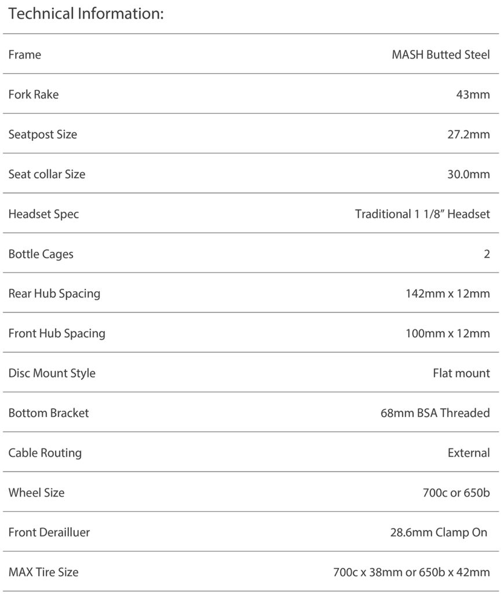

## Parts

<dl>
  <dt>
  Frame
  </dt>
  <dd>MASH steel all-road</dd>
  <dt>Crankset</dt>
  <dd>Sram Rival 1 x 12</dd>
  <dd></dd>
  <dt>Bars</dt>
  <dd></dd>
  <dt>Wrap</dt>
  <dd></dd>
  <dt>Stem</dt>
  <dd></dd>
  <dt>Wheelset</dt>
  <dd>SRAM 303S</dd>
  <dt>Hub</dt>
  <dd>SRAM XDR</dd>
  <dt>Casette</dt>
  <dd></dd>
  <dt>Derailleur</dt>
  <dd></dd>
  <dt>Tires</dt>
  <dd></dd>
  <dt>Shifters</dt>
  <dd></dd>
  <dt>Disc rotors</dt>
  <dd></dd>
  <dt>Disc calipers</dt>
  <dd></dd>
  <dt>Chain</dt>
  <dd></dd>
  <dt>Headset</dt>
  <dd></dd>
  <dt>Seat post</dt>
  <dd>Whisky</dd>
  <dt>Saddle</dt>
  <dd></dd>
  <dt>Bottom bracket</dt>
  <dd></dd>
  <dt>Mullet interface</dt>
  <dd>Ratio 1 x 12 wide rear facing kit</dd>
</dl>

### Specifications

### Geometry

## Learnings

### Facing

### XD is compatible with XDR

## References

[kinopio]: https://kinopio.club/bike-build-mash-all-road-mullet-8cYbIr_r9RpbQJeshXTc0
[mash]: https://www.mashsf.com/news/mash/mash-steel-all-road-frameset

1. [Kinopio mind map][kinopio]
1. [MASH steel all-road frameset][mash]
