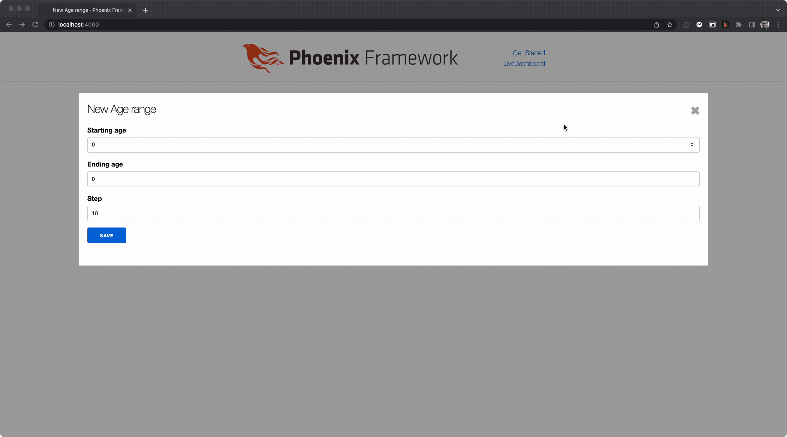
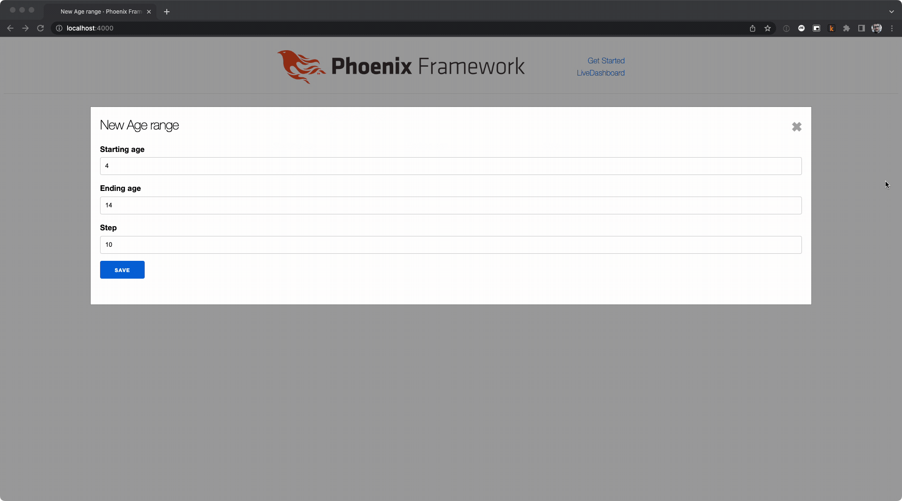

## Description

When modifying form values in Phoenix LiveView, it is possible to modify the value of all form fields **that are not in focus** on the client side from the server side. It is not possible to modify values **that are in focus** on the client side from the server side with LiveView only.

## The example

Suppose you have a form that is backed by a schema for an age range. When the user modifies the `start_age`, the `end_age` is modified to be `start_age + step`. That schema is of the following form.

```elixir
defmodule App.Demo.AgeRange do
  use Ecto.Schema
  import Ecto.Changeset

  @primary_key {:id, :binary_id, autogenerate: true}
  @foreign_key_type :binary_id
  schema "age_range" do
    field :starting_age, :integer, default: 0
    field :ending_age, :integer, default: 0
    # denotes how much distance there should be between start and end range
    field :step, :integer, default: 10

    timestamps()
  end

  @doc false
  def changeset(age_range, attrs) do
    age_range
    |> cast(attrs, [:starting_age, :ending_age, :step])
    |> validate_required([:starting_age, :ending_age, :step])
  end
end
```

### The associated repo

The code for this post can be found [here](https://github.com/blakedietz/phoenix-liveview-form-focus).

## Out of focus elements can be modified

The element that is in focus in the example is `starting_age`. `ending_age` is not in focus and is having its value updated when the `starting_age` is updated.

```elixir
def handle_event(
      "validate",
      %{"age_range" => %{"starting_age" => starting_age}},
      socket
    ) do
  changeset =
    socket.assigns.age_range
    |> Demo.change_age_range(%{
      # Here' we're modifying the ending_age form element and changes are being accepted.
      starting_age: starting_age |> String.to_integer(),
      ending_age: (starting_age |> String.to_integer()) + 10
    })
    |> Map.put(:action, :validate)

  {:noreply, assign(socket, :changeset, changeset)}
end
```

Associated code block [here](https://github.com/blakedietz/phoenix-liveview-form-focus/blob/1a6383d251405460202e152d749df624074a6e25/lib/app_web/live/age_range_live/form_component.ex#L41).



## In focus elements cannot be modified

The element that is in focus is `step`. When attempting to modify `step` from the server side, the value is not modified.

```elixir
# Here `handle_event` captures all changes for the `step` input only. Upon change `step` is set the value of 0. Note in the gif that it doesn't override the form value on the client side.
def handle_event(
      "validate",
      %{
        "_target" => ["age_range", "step"],
        "age_range" => %{"starting_age" => starting_age}
      },
      socket
    ) do
  changeset =
    socket.assigns.age_range
    |> Demo.change_age_range(%{
      starting_age: starting_age |> String.to_integer(),
      ending_age: (starting_age |> String.to_integer()) + 10,
      # Here we expliclity are trying to set the value to 0, but it does nothing. See
      # images/in-focus.gif.
      step: 0
    })
    |> Map.put(:action, :validate)

  {:noreply, assign(socket, :changeset, changeset)}
end
```

Associated code block [here](<[true](https://github.com/blakedietz/phoenix-liveview-form-focus/blob/1a6383d251405460202e152d749df624074a6e25/lib/app_web/live/age_range_live/form_component.ex#L16)>).


