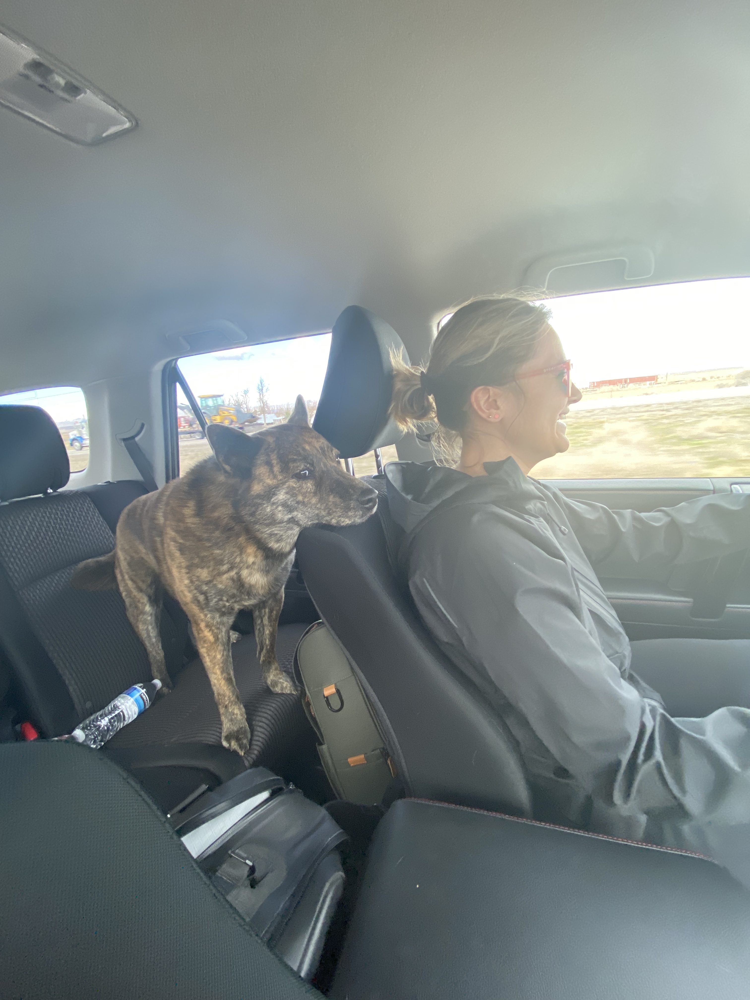

## What I'm grateful for

### Remote work

This week I travelled to Pocatello with my partner Allyanna and it was all possible because I'm able to work remote.

## What I'm thinking about

### Stoicism

## What I'm working on

### https://www.b4b.guide

I'm working on a fun little side project for personal use. The project is essentially a shared deck editor for the video game "Back 4 Blood". It's written in the PETAL stack.

## What I'm reading

- [H.264 is magic](https://sidbala.com/h-264-is-magic/)
- [Elixir code smells](https://github.com/lucasvegi/Elixir-Code-Smells/blob/main/README.md)
- [Kettle logic](https://en.wikipedia.org/wiki/Kettle_logic)

## What I'm watching

### Better Call Saul

Breaking bad was one of my favorite shows of all time. Vince Gilligan does not disappoint with this spinoff.

### Watchmen

I've really been enjoying this show. It's set 30 years after the original comic book series and weaves the challenges that African Americans have faced in America into gritty comic book action. Trent Reznor and Atticus Ross composed the soundtrack and it's damn good.

## What I'm listening to

### With Teeth by Nine Inch Nails

I always find myself coming back to Nine Inch Nails.

<iframe style="border-radius:12px" src="https://open.spotify.com/embed/album/56Us3Q6UIM4jKJZlWhqddL?utm_source=generator" width="100%" height="380" frameBorder="0" allowfullscreen="" allow="autoplay; clipboard-write; encrypted-media; fullscreen; picture-in-picture"></iframe>

### Ghosts on tape by Blood Red Shoes

<iframe style="border-radius:12px" src="https://open.spotify.com/embed/album/65zRHfqj1uInYUCZInyDvF?utm_source=generator" width="100%" height="380" frameBorder="0" allowfullscreen="" allow="autoplay; clipboard-write; encrypted-media; fullscreen; picture-in-picture"></iframe>

## References

1. [Phoenix LiveView constantly refreshes with custom domain](https://community.fly.io/t/phoenix-liveview-constantly-refreshes-with-custom-domain/3384)
1. [Tailwind not working in production (no styles just plain html)](https://elixirforum.com/t/tailwind-not-working-in-production-no-styles-just-plain-html/45192/3)
1. [H.264 is magic](https://sidbala.com/h-264-is-magic/)
1. [Elixir code smells](https://github.com/lucasvegi/Elixir-Code-Smells/blob/main/README.md)
1. [Kettle logic](https://en.wikipedia.org/wiki/Kettle_logic)