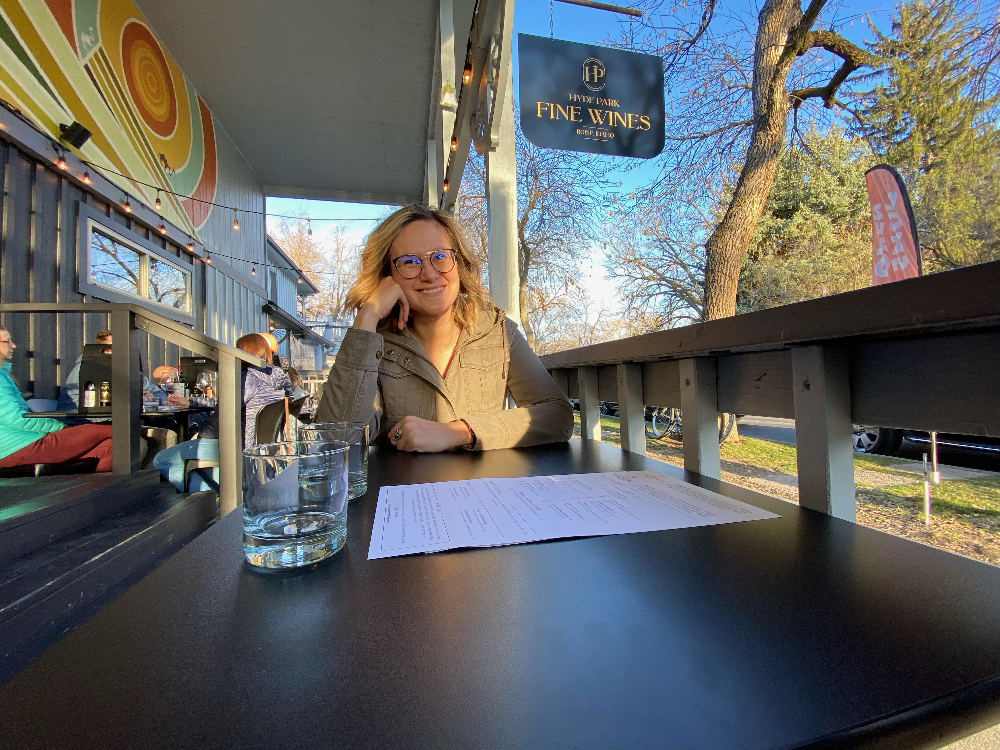

## What I'm grateful for

### My partner Allyanna

Allyanna and I celebrated our 11.5 year anniversary with a date at the first restaurant we went to together: Papa Joe's.

Before that we went to Hyde Park Wine and grabbed our monthly allotment while enjoying some of our complimentary tastings and the gorgeous weather. All of that was topped off with the simplicity of riding our bikes to each location.

## What I'm thinking about

Nothing specific this week.

## What I'm working on

### Updated blakedietz.me to support mermaid.js

I absolutely love mermaid.js to aid my thinking with diagrams. I used https://github.com/remcohaszing/gatsby-remark-mermaid to incorporate it into this blog.

### b4b.guide

I was able to crack the AES key for b4b which finally let me get a hold of the in game assets and textures. This will help a ton with my overall card design for the app.

## What I'm reading

### [Designing a REST API: Unix time vs ISO-8601](https://nickb.dev/blog/designing-a-rest-api-unix-time-vs-iso-8601)

## What I'm watching

### The dark side of minimalist design

<iframe width="560" height="315" src="https://www.youtube.com/embed/cMDGwj1QlSU" title="YouTube video player" frameborder="0" allow="accelerometer; autoplay; clipboard-write; encrypted-media; gyroscope; picture-in-picture" allowfullscreen></iframe>

## What I'm listening to

Nothing specific this week.

## References

* [Ask HN: What bits of fundamental knowledge are productivity multipliers? | Hacker News](https://news.ycombinator.com/item?id=30853807)
* [Ask HN: How do you find peers in your field who care about their craft? | Hacker News](https://news.ycombinator.com/item?id=30858942)