## Dactyl manuform 5 x 6 build guide

The dactyl manuform is an open source ergonomic split keyboard. This board is a mixture of two other open source split ergonomic keyboards: namely the [dactyl][gh-dactyl] and the [manuform][gh-manuform]. Thus you can see where it gets its name from.

⚠️⚠️WORK IN PROGRESS⚠️⚠️

This guide is a work in progress. I'm currently working through building it so don't take it as gospel until it's done. I'd rather publish things incrementally than leave it all until the very end to make sure I capture all of my thoughts.

### Materials

| Material                                             | Description | Quantity | Cost | Link                       |
| ---------------------------------------------------- | ----------- | -------- | ---- | -------------------------- |
| 1418 diode                                           |             |          |      |                            |
| Amoeba single switch pcb                             |             |          |      | [Keebio][keebio-amoeba]    |
| Elite C micro controller                             |             |          |      |                            |
| Female Lemo socket                                   |             |          |      |                            |
| Harajuku pink filament                               |             |          |      |                            |
| Mill-Max Manufacturing Corp. 0305-2-15-80-47-80-10-0 |             |          |      | [Digikey][digikey-hotswap] |
| Kester leaded solder                                 |             |          |      |                            |
| Male Lemo socket                                     |             |          |      |                            |
| Male TRRS connector                                  |             |          |      |                            |
| Female TRRS jack                                     |             |          |      |                            |
| Male USB-C connector                                 |             |          |      |                            |
| Wire                                                 |             |          |      |                            |

### Tools

| Tool             | Use | Link |
| ---------------- | --- | ---- |
| Cutting mat      |     |      |
| Tweezers         |     |      |
| Soldering iron   |     |      |
| Desoldering pump |     |      |
| Loupe            |     |      |
| Wire stripper    |     |      |
| Alligator clips  |     |      |

### Part list breakdown

We'll discuss why we chose each part

### Some names

Before we begin I want to make sure that we're on the same page. Let's give some names to a few things to make it easier to communicate throughout the guide.

#### Board orientation

##### Top

##### Bottom

### Fabrication

#### Tips

Don't go following these tips quite yet. Just peruse through before beginning your build.

##### Bending diode legs

##### Breaking up the amoeba boards

Breaking the boards can be difficult. Sometimes it can feel like you're going to break it the wrong way. I've found the easiest way to break off the individual pcbs is to let one row of the board hang off of a table.

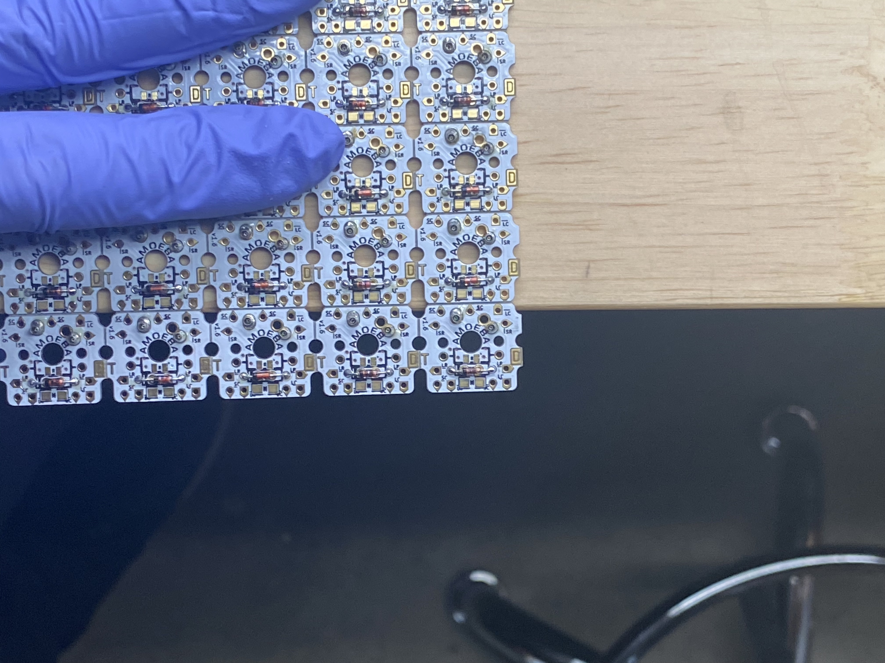

Once you do that push down on the row that is off of the straight edge until it breaks off.

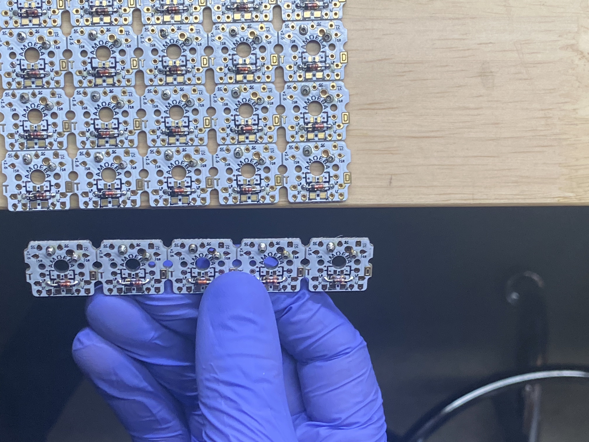
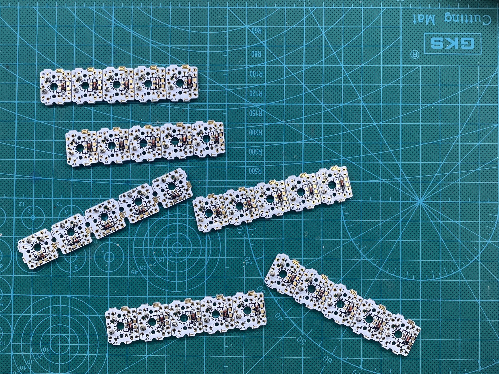

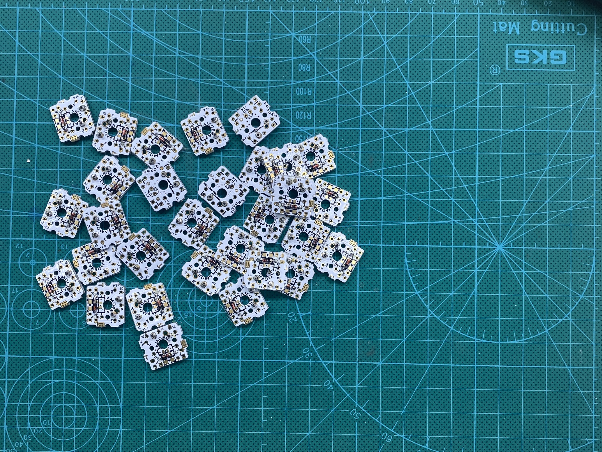

#### Guide

#### Printing

##### Choosing your model

##### Remove plastic supports

##### Make sure the case is level

#### Soldering resistors

Note the orientation of resistor

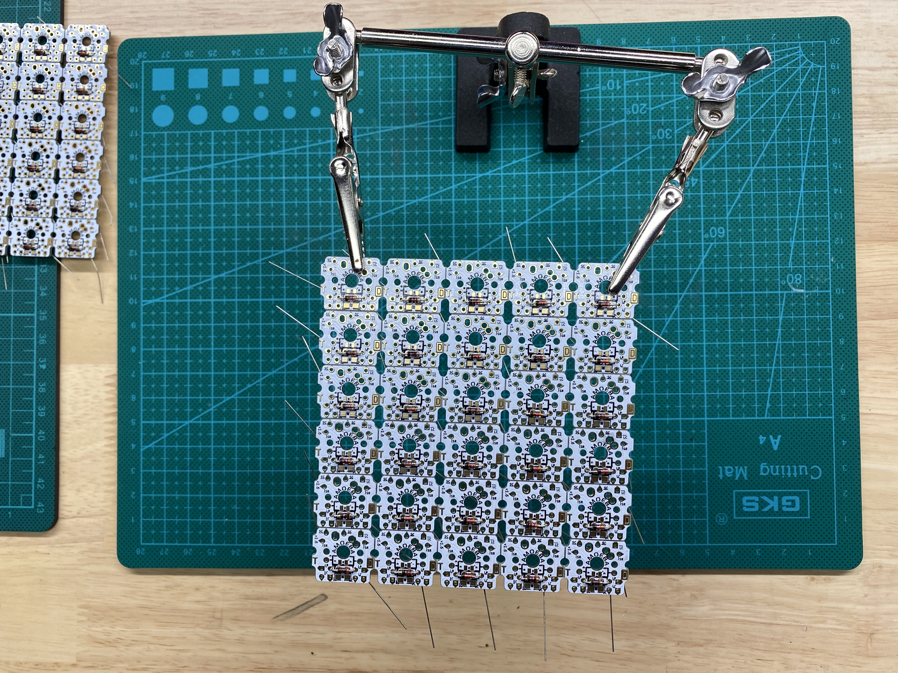

#### Soldering holtites

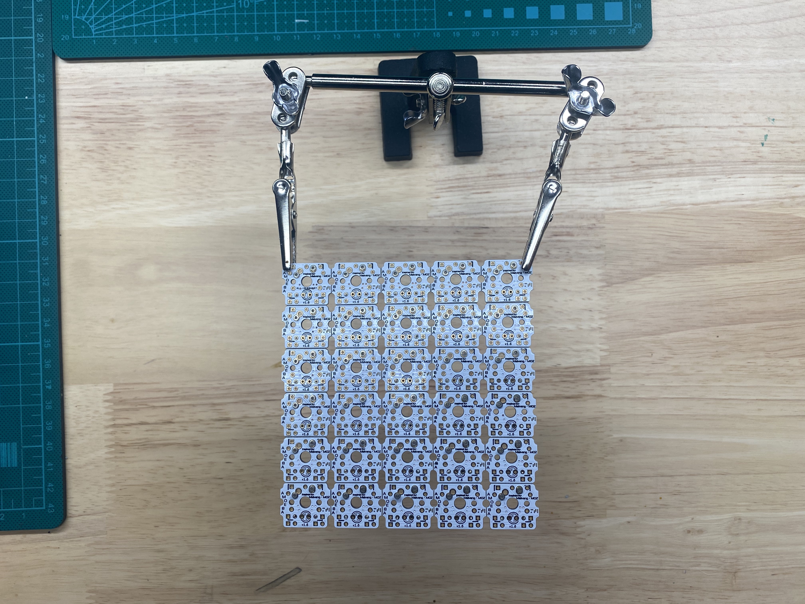
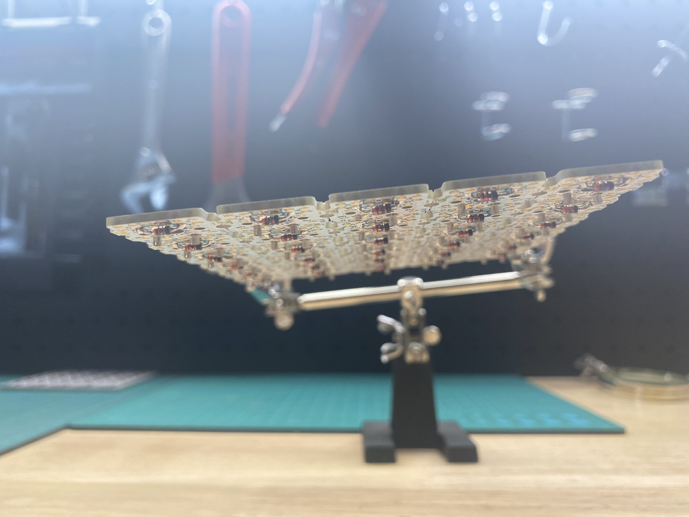

#### Placing amoebas on the board

##### Insert switches

##### Insert amoebas

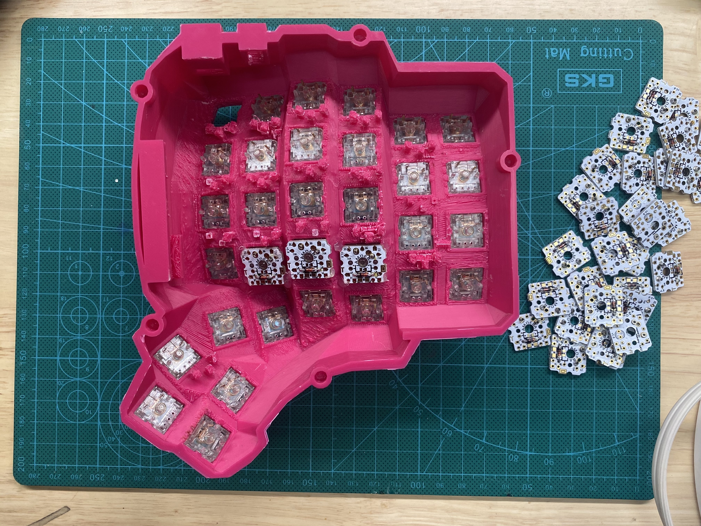
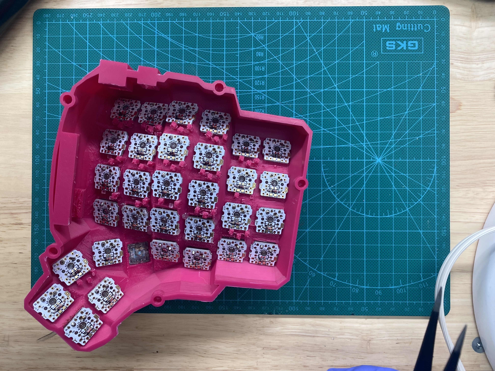

###### Sand down amoebas

One internal

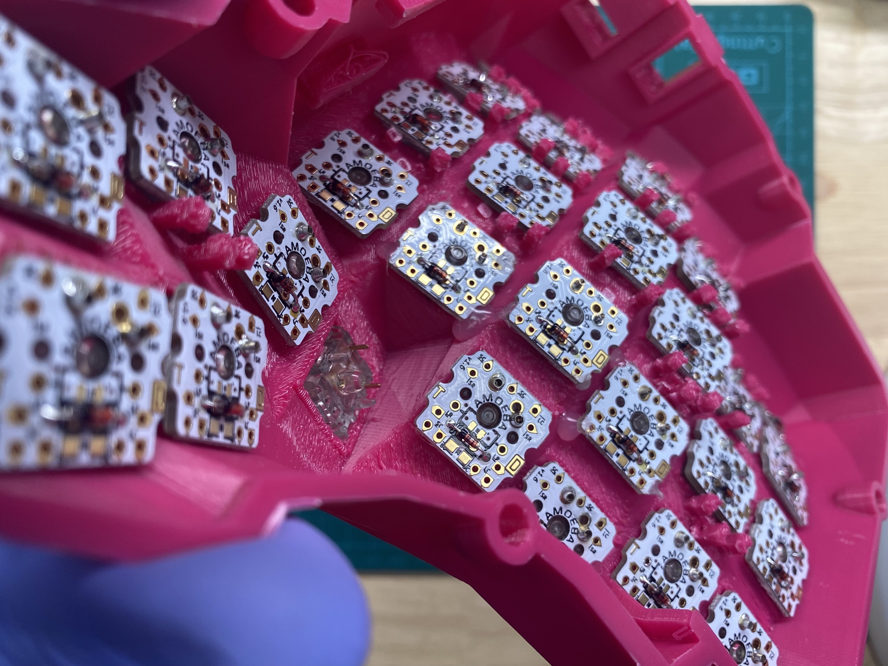

One on thumb cluster

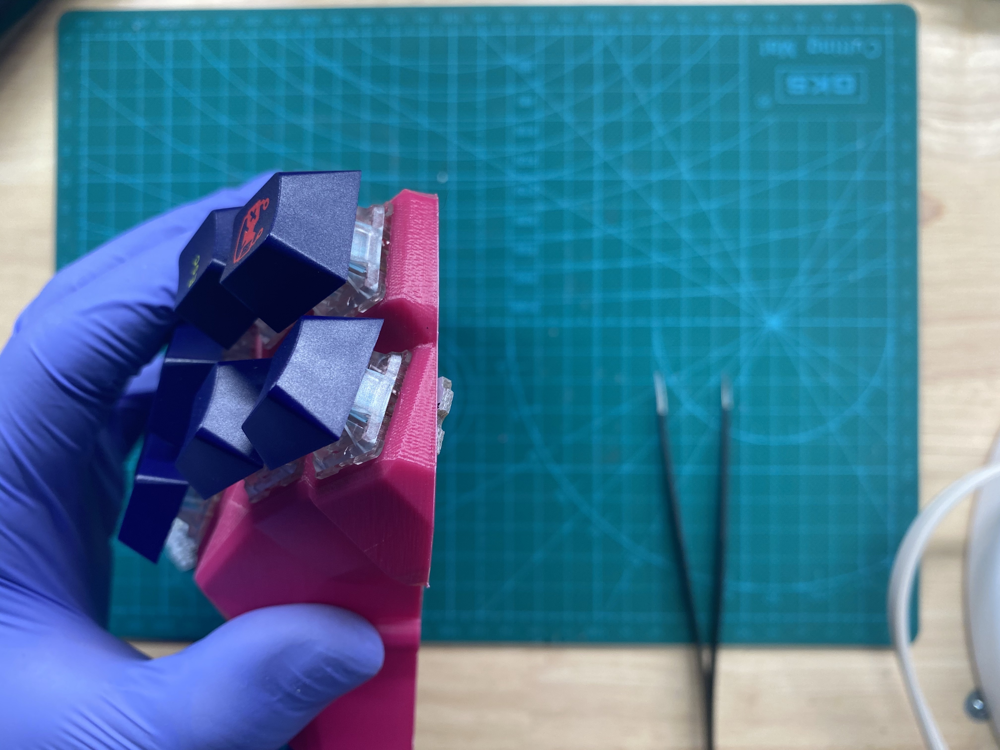

#### Soldering rows

#### Soldering columns

#### Soldering micro controller headers

#### Attaching columns to micro controller

#### Attaching rows to micro controller

#### Assembling cables

#### Attaching connections to case

#### Flashing

## Sources

[gh-dactyl-manuform]: https://github.com/abstracthat/dactyl-manuform
[gh-tshort-dactyl-manuform]: https://github.com/tshort/dactyl-keyboard
[gh-dactyl]: https://github.com/adereth/dactyl-keyboard
[gh-manuform]: https://github.com/jeffgran/ManuForm
[keebio-amoeba]: https://keeb.io/products/amoeba-single-switch-pcbs?variant=12960782024798
[keebio-trrs]: https://keeb.io/collections/split-keyboard-parts/products/trrs-jack-3-5mm
[keebio-atmega]: https://keeb.io/collections/split-keyboard-parts/products/pro-micro-5v-16mhz-arduino-compatible-atmega32u4
[digikey-hotswap]: https://www.digikey.com/product-detail/en/0305-2-15-80-47-80-10-0/ED90584-ND/2639493?utm_medium=email&utm_source=oce&utm_campaign=3078_OCE20RT&utm_content=productdetail_US&utm_cid=281532&so=63791702&mkt_tok=eyJpIjoiT1dFNVpXWmlNVFpoWldZMCIsInQiOiJTdG9JQzdjU3cwcDI1WFZwTnV0MDI3bkIxQWNaN3JPYlZtZTd2WlwvMlZ1SHFudzBjVG9kZ09Jek1oOXJYYkJVYmVJdnBVSWFWcno3TVhYR285VDlIUFBUWnRBdVgxQVVScndYeU9VdFFyQXBWbHhQQmFkaU9JVEluOTNicGNyQnMifQ%3D%3D
[build-guide]: https://imgur.com/gallery/fSdT5sF

1. [abstractthat dactyl manuform repo][gh-dactyl-manuform]
1. [tshort dactyl manuform repo][gh-tshort-dactyl-manuform]
1. [adereth dactyl repo][gh-dactyl]
1. [jeffgran manuform repo][gh-manuform]
1. [kaarukun's dactyl-manuform build guide][build-guide]
