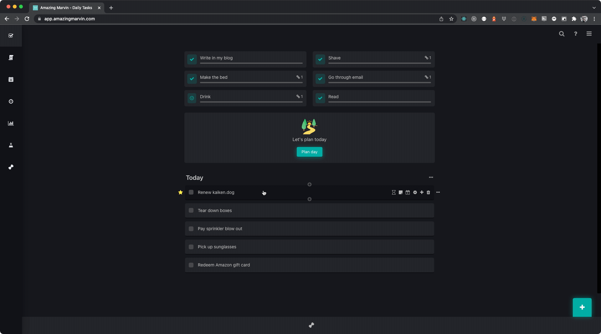

I've been tickled by how delightful Amazing Marvin's user experience is. The developers of Amazing Marvin consistently go above and beyond when implementing features. They carefully tailor the experience for the user, sometimes eschewing common design patterns and adding their own flare for even the smallest interactions. If you're looking for a task management system I highly recommend giving https://amazingmarvin.com/ a try.

My favourite UI so far is the task list. In particular, the hover functionality of the list is the most interesting design choice.

## Example

## Why this is an elegant UI

### Fewer number of steps

The typical task list will have one or two points in the UI to add a new task. This will commonly be a top level button outside the task list as well as a ghost row inlined in the task list. With both of these UI elements you must first click the element, type your text and then drag the element into the order that you want it to be in.

Typical task list UX

- Find one of two creation control elements
- Click the element
- Find the new element in the list that was added
- Type the text for the newly created item
- Drag the element to the row in the list that you want it to be in

Amazing Marvin task list UX

- Find the element you want your new task to be above or below
- Click the top or bottom plus sign
- Type the text for the newly created item

### Less context switching

On top of being a fewer number of steps for the user, I think the more important metric is the reduction of context switching. For the sake of this article, let's define context switching as the act of the user changing attention from one ui element to another.

In the typical task list UX, users need to move their eyes from the detail list view to the top level button or to the inline ghost button. Typically the user has scrolled to the point of interest in the list and realise that a new task needs to be added, often times, around the point where the list is currently scrolled.

#### Using the master element

When using the top level list item add, a lot of the time (I'm looking at you JIRA) the user must scroll to the top of the page if the list does not have a sticky header of some sort. The user must then click add and scroll to the bottom of the list to add detail about the list item. From there the user must then move the item often times with a janky scrolling experience as the user must both hold the left click down to keep hold of the item to be prioritised and then drag the element high enough up the list to place the item in the desired order.

Simply looking at the type of movement that a user must mouse movement almost looks like an N pattern. The user starts at the bottom moving up (|) then after clicking the master element the user has to move to the bottom of the list (|\) then the user has to drag the element to the desired location in the list (|\|). It's quite the mess.

