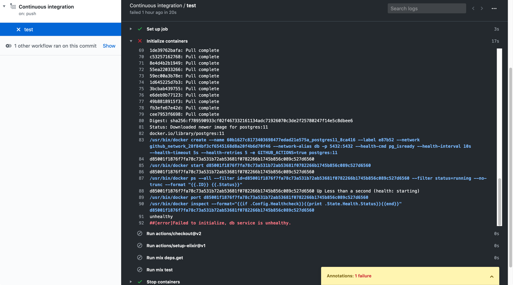
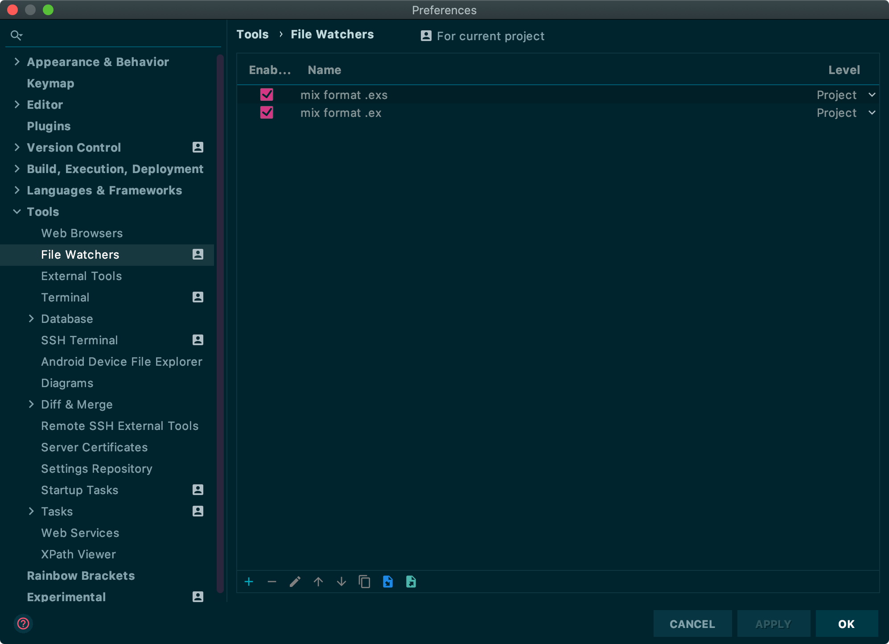
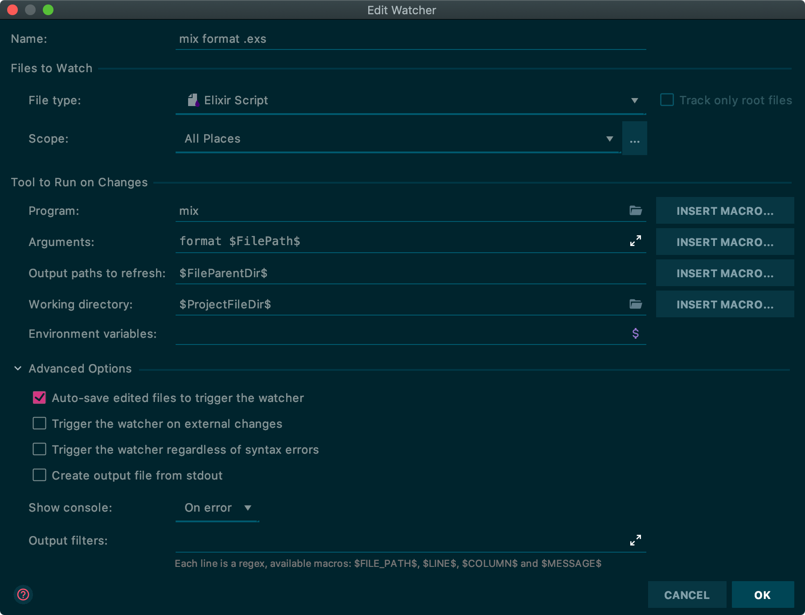
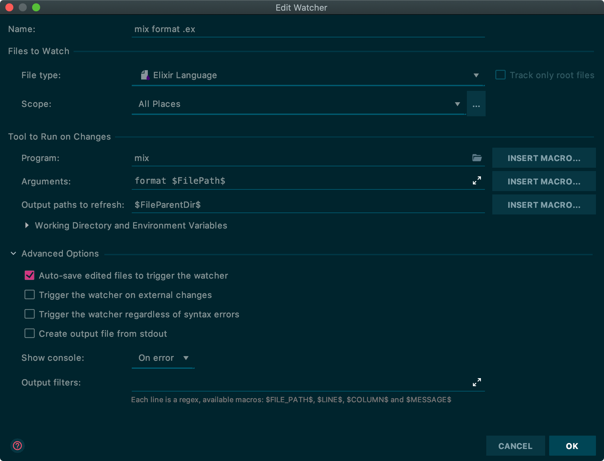

## Github actions

Github actions allows you to set up arbitrary tasks that can run based upon events in Github. You can use these actions to do all sorts of things. I wanted to use these actions to setup a continuous integration workflow for my application backend written in elixir for a personal project of mine.

### Continuous integration with elixir

I found a [useful community action][ga-elixir] that sets up your Github workflow container for elixir and erlang dependencies for you. There are a couple of things to note about the example that's provided in the [elixir setup][ga-elixir] Github actions page. By default the Phoenix example in the setup instructions is failing on the current version of Github actions for Postgres 11.

You'll get the following error:

> Failed to initialize, db service is unhealthy.



Thanks to [this][ga-postgres] link I was able to find the fix. You need to add an env section with the username and password that you use for your test environment.

```yaml
env:
  POSTGRES_USER: postgres
  POSTGRES_PASSWORD: postgres
  POSTGRES_DB: postgres
```

On top of that I added a check for formatting constraints

```yaml
# Check for code style formatting that doesn't match code standards
- run: mix format --check-formatted
```

Which yields the following for the final code to run unit tests and formatting checks in Github actions.

```yaml
# .github/workflows/continuous-integration.yml

name: Continuous integration

on: push

jobs:
  test:
    runs-on: ubuntu-latest

    services:
      db:
        image: postgres:11
        ports: ["5432:5432"]
        # Add this: This is required to fix the health status problem
        env:
          POSTGRES_USER: postgres
          POSTGRES_PASSWORD: postgres
          POSTGRES_DB: postgres
        options: >-
          --health-cmd pg_isready
          --health-interval 10s
          --health-timeout 5s
          --health-retries 5

    steps:
      - uses: actions/checkout@v2
      - uses: actions/setup-elixir@v1
        with:
          otp-version: 22.2
          elixir-version: 1.9.4
      - run: mix deps.get
      - run: mix test
      # Check for code style formatting that doesn't match code standards
      - run: mix format --check-formatted
```

## Jetbrains

### Autoformat with mix format

This isn't something I didn't necessarily know about, but it's something I always find myself configuring for each project. In Jetbrains products you can set up a file watcher to run an arbitrary script based upon a file change. You can use this to autoformat your files with `mix format`. To do so create the following configurations in your JetBrains product of choice. I use Intellij, but this should apply to any of the JetBrains products including WebStorm, PHPStorm, RubyMine, you name it.

#### File watchers



#### .exs autoformat



#### .ex autoformat



## Sources

[ga-elixir]: https://github.com/actions/setup-elixir
[ga-postgres]: https://github.community/t5/GitHub-Actions/Mysql-service-never-comes-up-healthy-in-action/m-p/38363#M3317
[mix-format]: https://hexdocs.pm/mix/master/Mix.Tasks.Format.html

1. [Github actions - setup elixir][ga-elixir]
2. [Postgres service never comes up healthy in action ][ga-postgres]
3. [mix format docs][mix-format]
