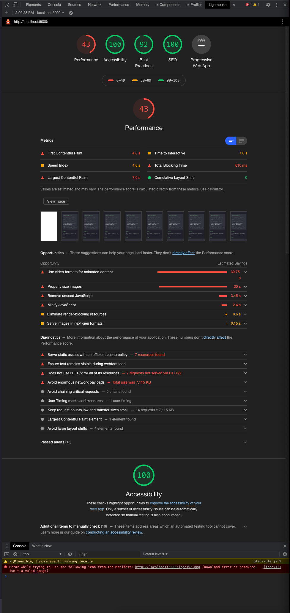
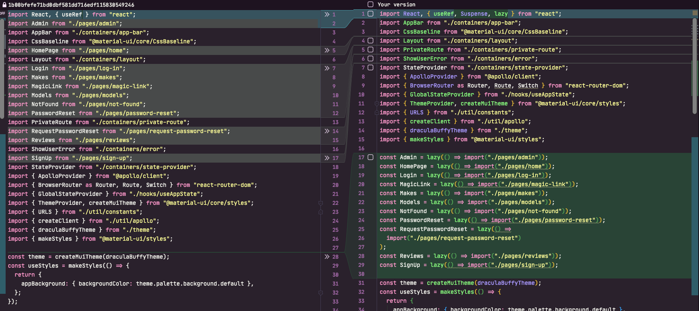

## Some easy ways to improve your application performance

### Make your production build

In order to best test against production assets locally, we'll build the final bundle.

```
# cd into your cra project root
# I'm assuming you've already installed application dependencies
npm run build
# Install a static file server locally
npm i -g serve
# Serve your production assets locally
serve -s build
```


### Find the gaps

First of all, you need to identify if your application has any performance issues. Chrome has a built in tool called lighthouse that you can leverage to identify specific performance bottlenecks.

1. Navigate to your local address for navigation
1. Open Chrome dev tools
1. Look for the lighthouse tab


Lighthouse is ridiculously powerful. Learn more about what it does and how to use it [here](lighthouse).

The simplest way to get started is to click "Generate report".


Once the report is generated you'll see a general breakdown of how your app scored at the top.


Judging from the report, there are some big offenders here. 30.9s could be shaved off by removing a big gif. Another image based critique is given. These are relatively simple fixes that we'll ignore for the sake of focusing on CRA specific improvements.

Next we'll focus on unused javascript as this will impact almost every React based app. Clicking on that tab yields the following:


The first thing that jumps out to me is that react dev tools are being shipped down with the bundle. For development builds this makes sense, however, for production I'm a bit surprised that this is CRA's default behavior. That's a whole 444.4KB that can be shaved off of the app bundle.

After doing some searching, I found that there's a Github link for removing React dev tools from production assets.

You can add the following to your `index.html` to disable

```html
<body>
  <noscript>You need to enable JavaScript to run this app.</noscript>
  <div id="root"></div>
  <% if (process.env.NODE_ENV === 'production') { %>
  <script>
    // before React is loaded
    if (typeof window.__REACT_DEVTOOLS_GLOBAL_HOOK__ === "object") {
      __REACT_DEVTOOLS_GLOBAL_HOOK__.inject = function() {}
    }
  </script>
  <% } %>
  <!--
      This HTML file is a template.
      If you open it directly in the browser, you will see an empty page.

      You can add webfonts, meta tags, or analytics to this file.
      The build step will place the bundled scripts into the <body> tag.

      To begin the development, run `npm start` or `yarn start`.
      To create a production bundle, use `npm run build` or `yarn build`.
    -->
</body>
```

Alright, let's generate a new report and see what that new score is!



Wow! A performance score of 36 is now 43. That's great, but, we can do better. Looking at the next big ticket item that's javascript related, we have the "Remove unused javascript" section.


Lighthouse is so powerful that it even picks up on project frameworks and gives you smart recommendations.

After doing some reading I found that the React docs recommend starting at the [route level](route-level) to leverage code splitting. This turned out to work well with my project because I'm utilizing `react-router-dom` for my routing mechanism.

The documentation recommends leveraging `suspense` along with `lazy` and dynamic `import`.

Here's what my code before and after:



Essentially I took anything that was a route level component and converted it from the usual ESmodule import to use `lazy` and dynamic import`import`

You'll also need to wrap all of your router routes in the `Suspense` component as well.


Running `npm run build` now shows a different output from before.


Previously there were 3 different chunks. As you can see there's quite a few more after this change, and this is exactly what we want. Leveraging code splitting, the application is able to separate parts of our application into separate assets. These assets are only loaded when the application requires them at runtime. This allows for reducing overall asset sizes which helps to improve load times.

So, what's our new score?


89! It's not perfect, but we're getting there! Leveraging code splitting, our score jumped 46 points in total. That's pretty significant and puts the application on the edge of a good rating.

## References

[lighthouse]: https://developers.google.com/web/tools/lighthouse
[gh-191]: https://github.com/facebook/react-devtools/issues/191
[react-suspense]: https://web.dev/code-splitting-suspense/?utm_source=lighthouse&utm_medium=devtools
[route-level]: https://reactjs.org/docs/code-splitting.html#route-based-code-splitting

1. [Lighthouse](lighthouse)
1. [Removing dev tools issue](gh-191)
1. [React.lazy()](react-suspense)
1. [Route based code splitting](route-level)
